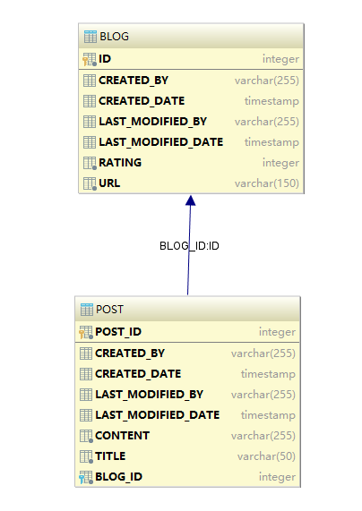
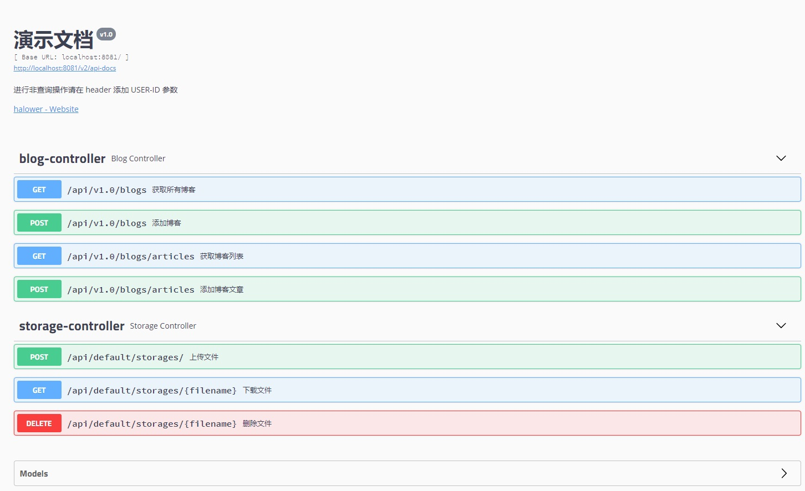

# 5分钟快速上手

## 创建项目

假设已搭建好了[开发环境](basic/环境搭建.md) ，提前安装好`lombok`插件，创建一个空的`MAVEN` / `Gradle` 项目（Gradle请使用4.7版本），结构如下

```
─src
    ├─main
    │  ├─java
    │  │  └─com
    │  │      └─demo    
    │  │          ├─controller
    │  │          ├─domain
    │  │          ├─repository
    │  │          └─service
    │  │              └─blog
    │  │                  └─dto
    │  └─resources
    └─test

```

这个示例以`h2`数据库作为演示，以比较经典的简单博客模型作为基础，同时使用`gradle`构建，使用如下代码替换`build.gradle`

```build.gradle
group 'your's group'
version '1.0-SNAPSHOT'

buildscript {
    ext {
        springBootVersion = '2.1.2.RELEASE'
    }
    repositories {
        maven { url 'http://192.168.2.119:8081/repository/maven-public/' }
    }
    dependencies {
        classpath("org.springframework.boot:spring-boot-gradle-plugin:${springBootVersion}")
    }
}

apply plugin: 'java'
apply plugin: 'idea'
apply plugin: 'org.springframework.boot'
apply plugin: 'io.spring.dependency-management'

sourceCompatibility = 1.8

repositories {
    mavenLocal()
    maven { url 'http://192.168.2.119:8081/repository/maven-public/' }
}

compileJava {
    file('/src/main/java/').mkdirs()
    options.compilerArgs << '-processor' << 'com.querydsl.apt.jpa.JPAAnnotationProcessor' << '-s' << file('/src/main/java/').absolutePath
}

dependencies {
    implementation('com.github.halower:newbie-spring-boot-starter')
    implementation group: 'com.h2database', name: 'h2', version: '1.4.196'
}

dependencyManagement {
    imports {
        mavenBom 'com.github.halower:newbie-spring-boot-management:alpha.qcs.1.3.5'
    }
}

tasks.withType(JavaCompile) {
    options.encoding = 'UTF-8'
}

```
在 `resources` 中添加 `application.properties`
```

# 在线文档
swagger.title=演示文档
swagger.description=进行非查询操作请在 header 添加 USER-ID 参数
swagger.version=1.0.0.RELEASE
swagger.contact.name=维护人/团队
swagger.contact.url=维护人URL
swagger.contact.email=维护人email
swagger.base-path=/api/**
swagger.exclude-path=/error
spring.application.name=newbie
spring.jpa.hibernate.ddl-auto=none
spring.jpa.show-sql=true
spring.jpa.database-platform=org.hibernate.dialect.H2Dialect
spring.datasource.url=jdbc:h2:file:d:/db
spring.datasource.username=sa
spring.datasource.password=sa
spring.datasource.driver-class-name=org.h2.Driver
spring.data.rest.base-path=api
spring.cache.type=none
server.port=8080
logging.level.root=info

```
**编写main函数**

``` 程序入口代码
@SpringBootApplication
public class BlogApplication {
    public static void main(String[] args) {
        SpringApplication.run(BlogApplication.class,args);
    }
}
```

## 建立模型
?> 在`domain`下创建以下模型，博客与文章是*一对多*关系
```Blog

@Data
@Entity
//若表名称和数据库名称不一致，请添加@Table(name="XXX")注解
public class Blog extends BaseAudited {
    @Id
    @GenericGenerator(name = "system-uuid", strategy = "uuid")
    @GeneratedValue(generator = "system-uuid")
    private String blogId;
    @Column(name = "url", nullable = false, length = 150)
    private String url;
    private int rating ;
    @OneToMany(mappedBy ="blog",cascade=CascadeType.ALL,fetch=FetchType.LAZY)
    private List<Post> posts ;
}
```

```Post
@Data
@Entity
//若表名称和数据库名称不一致，请添加@Table(name="XXX")注解
public class Post extends BaseAudited {
    @Id
    @GenericGenerator(name = "system-uuid", strategy = "uuid")
    @GeneratedValue(generator = "system-uuid")
    private String postId ;
    @Column(nullable = false, length = 50)
    private String title;
    @Column(nullable = false)
    private String content;
    @ManyToOne(cascade={CascadeType.MERGE,CascadeType.REFRESH},optional=false)
    @JoinColumn(name="blog_id")
    private Blog blog ;
}
```
自动生成的数据结构如下  



## 添加仓储接口
?> 在 `repository`下创建`BolgRepository`接口
```
public interface BlogRepository extends JpaRepository<Blog,String> {
}
```
## 添加服务接口
- 新增两个传输对象
```
@ApiModel("新增博客Dto")
@AllArgsConstructor
@Data
public class BlogInputDto implements InputDTO {
    @ApiModelProperty("博客链接")
    public String url;
}
```

```
@ApiModel("Blog输出参数")
@Data
@AllArgsConstructor
@NoArgsConstructor
public class BlogOutputDto implements OutputDTO {
    @ApiModelProperty("博客Id")
    public String blogId;
    @ApiModelProperty("博客鏈接")
    public String Url;
}

```

- 定义服务接口和实现类

```
BlogAppService.java
public interface BlogAppService extends ApplicationService {
    List<BlogOutputDto> fetchBlogs();
    String add(BlogInputDto input);
}
```

```
BlogAppServiceImpl.java
@Service
public class BlogAppServiceImpl implements BlogAppService {
    @Autowired
     private BlogRepository blogRepository;
    @Override
    public List<BlogOutputDto> fetchBlogs() {
        var blogs = blogRepository.findAll();
        var res = Mapper.init().map(blogs,new GenericsToken< List<BlogOutputDto>>() {});
        return res;
    }

    @Override
    public String add(BlogInputDto input) {
        var blog = input.map(Blog.class);
        var dbBlog = blogRepository.save(blog);
        return dbBlog.getBlogId();
    }

    @Override
    public Class<? extends Annotation> annotationType(){
        return null;
    }
}


```
## 添加控制器

```
@RestController
@RequestMapping("/api/v1.0/blogs")
public class BlogController {
    @Autowired
    private BlogAppService blogAppService;

    @GetMapping("/")
    @ApiOperation("获取所有博客")
    public ResponseResult<List<BlogOutputDto>> blogs() {
        var blogs = blogAppService.fetchBlogs();
       return  new ResponseResult<>(blogs);
    }

    @PostMapping("/")
    @ApiOperation("添加博客")
    public ResponseResult<String> add(@RequestBody BlogInputDto input) {
        var blogId = blogAppService.add(input);
        return  new ResponseResult<>(ResponseTypes.SUCCESS,blogId,"操作成功");
    }
}

```
> 现在就可以运行项目转到 <kbd>http://127.0.0.1:8080/swagger-ui.html</kbd> 


## 如何迁移到Oracle
- 替换驱动包
`compile group: 'com.oracle', name: 'ojdbc6', version: '11.2.0.3'`

- 修改配置
```
spring：
    database-platform: org.hibernate.dialect.OracleDialect
  datasource:
    url: jdbc:oracle:xxx:@xxx.xxx.xxx.xxx:1521/xxx
    username: xxxx
    password: xxxx
    driver-class-name: oracle.jdbc.driver.OracleDriver
```

!>配置 driver-class-name: oracle.jdbc.driver.OracleDriver后，     
如果抛出警告：Registered driver with driverClassName=oracle.jdbc.driver.OracleDriver was not found, trying direct instantiation.      
将oracle.jdbc.driver.OracleDriver修改为oracle.jdbc.OracleDriver即可。