# 代码提交 #

----------
### 使用工具 ###
代码管理工具:GIT  		
代码编辑工具：IDEA  
[GIT仓库地址点击这里](http://192.168.2.25:10080)

### 工具使用步骤 ###
##### IDEA配置GIT工具 #####
- GIT安装配置【安装】
  1. 下载GIT：
   [地址](https://192.168.2.187/!/#%E7%BB%9F%E4%B8%80%E4%B8%9A%E5%8A%A12.0/view/head/99_%E9%A1%B9%E7%9B%AE%E8%B5%84%E6%96%99/%E5%9F%BA%E7%A1%80%E7%8E%AF%E5%A2%83%E5%AE%89%E8%A3%85%E5%8C%85)  
  2. 点击安装，然后下一步，直到出现下面这个页面：  
  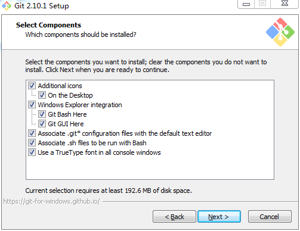  
  注：按照上图所示方式选中复选框；
  3. 点击下一步, 直到出现这个页面:  
  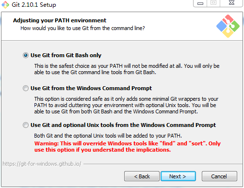  
  注：这个页面是选择git使用的命令行，建议选择第一个git自带的；
  4. 点击下一步, 直到出现下面这个页面:  
  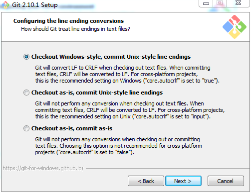  
  注：这个是选择行结束符，windows和linux行结束符不一致；建议选择第一个，这样git可以自动转换；
  5. 点击下一步, 直到出现下面这个页面:  
  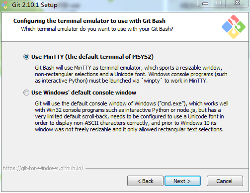  
  注：选择命令行窗口，建议第一个；
  6. 点击下一步, 直到出现下面这个页面:  
  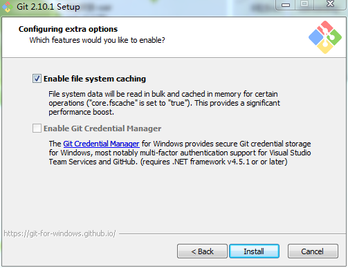  
  注：是否开启文件缓存，选择第一个；点击Install;
  7. 安装成功后: 击桌面上的git快捷方式打开命名行, 运行git命名, 出现如下界面则成功：  
  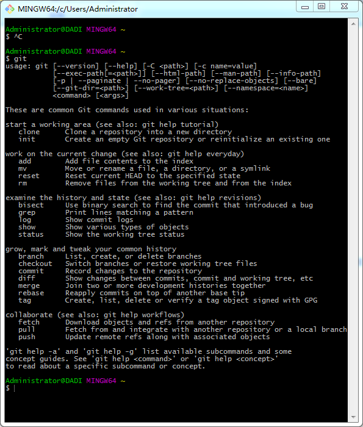
- GIT安装配置【windows配置git的SSH服务】
  1. 生成SSH秘钥对：在命令行中运行如下命令ssh-keygen -t rsa -C "你的邮箱地址"
  2. 完成以上命令后，会提示输入你的秘钥密码；根据提示输入相应的秘钥密码后会生成相应的秘钥文件如下图：  
  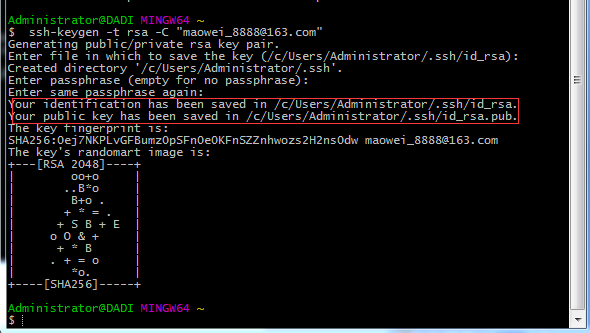
  3. 根据文件的生成路劲找到相应的id_rsa.pub文件，并用记事本或其他工具打开，复制相应的文件内容，如下图：  
  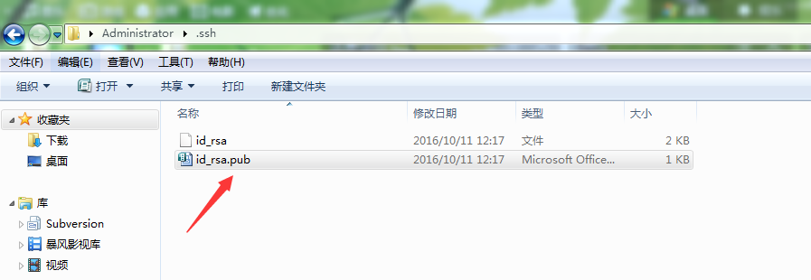
  4. 进入git管理平台中的信息设置页面，进行配对秘钥（即我们刚才所复制的文件内容）的设置，详细操作如下：  
  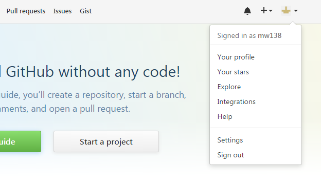  
  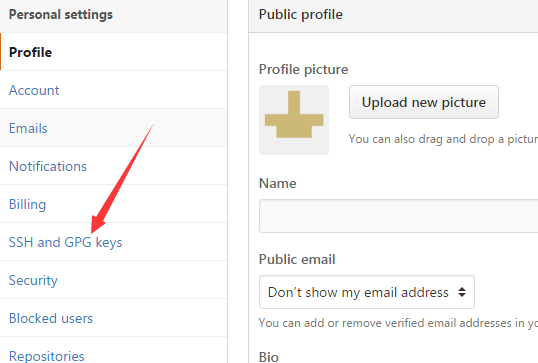  
  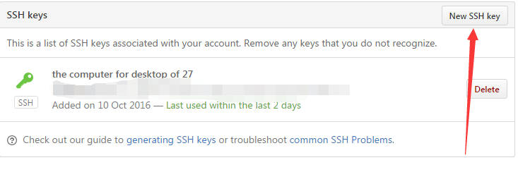  
  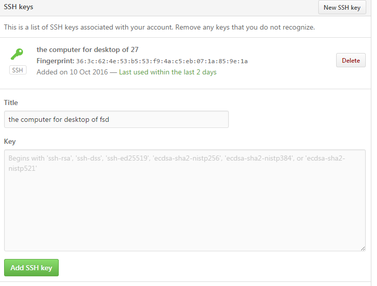  
  5. 执行以下命令配置全局用户名和邮箱：  
  git config --global user.name  "你的用户名"  
  git config --global user.email "你的邮箱"  
至此GIT工具的安装及配置已初步完成。
- IDEA配置GIT
  1. 打开IDEA工具，选择File-->Settings菜单如下图  
  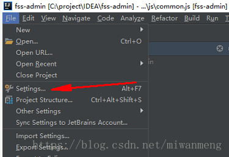  
  2. 在弹出框中选择Version Control-->Git进入GIT配置页面如下
  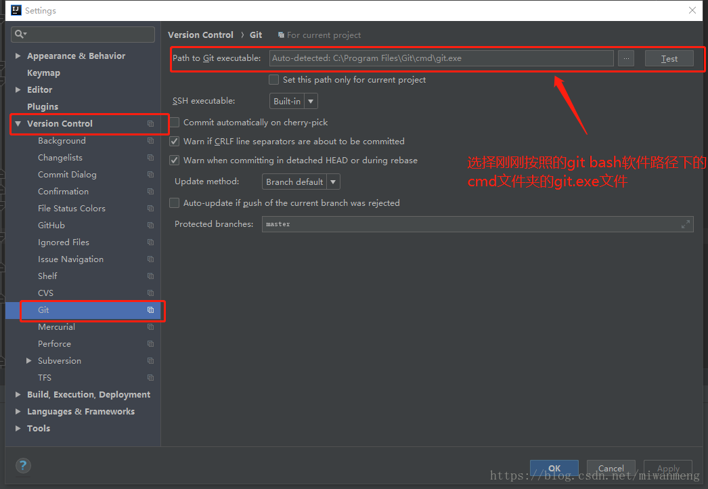  
  3. 在Path to Git executable列中输入/选择GIT工具的安装目录；即选择按照git bash软件路径下的cmd文件夹下的git.exe文件。
  4. 完成以上操作之后，点击OK按钮，这样IDEA就成功的集成了GIT。
##### IDEA中GIT工具的使用 #####
- 拉取GIT上已有项目  
  1. 依次选择菜单File-->New-->Project from Version Control-->Git进行GIT远程仓库地址的配置。  
  2. 在弹出的配置窗口中依次配置git项目地址（URL）及放到本地的地址(Directory),如下图：  
  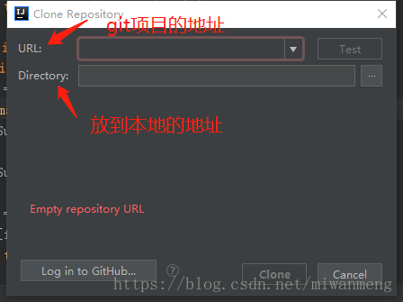  
  3. 填写完成后直接clone即可。需要注意的是，第一使用会弹出输入线上git网站的用户名和密码。至此就完成了将项目拉取至本地的操作。  
  注意：对项目代码更新文件的拉取只需要做如下操作：右键项目-->Git-->Repository-->Pull即可更新远程仓库代码文件至本地。
- 提交项目至GIT
  1. 右键需要提交的文件/文件夹依次选择菜单进行操作：Git-->CommitFile,如下图：  
  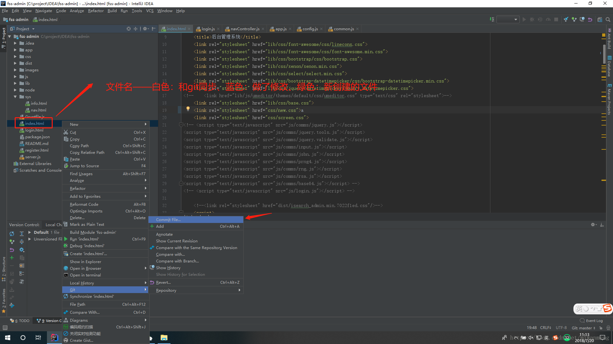  
  2. 在弹出窗口中选择需要提交的文件或文件夹，并在Commit Message中输入此次提交的相关说明，然后点击commit按钮，此时会将相应文件或文件夹提交至本地git仓库。如下图所示：  
  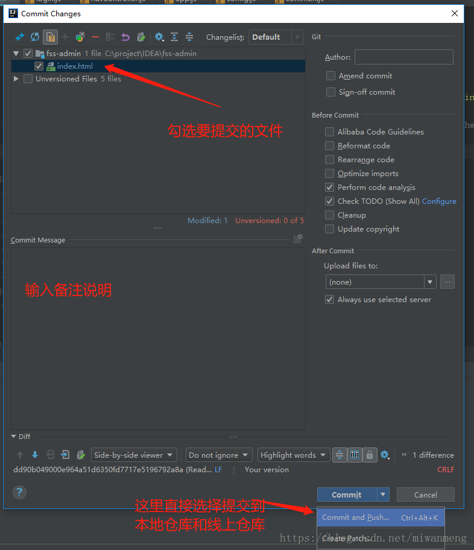  
  3. 将提交至本地仓库的代码文件或文件夹更新至远程git仓库，项目右键-->Git-->Repository-->Push，会出现如下的弹出框：  
  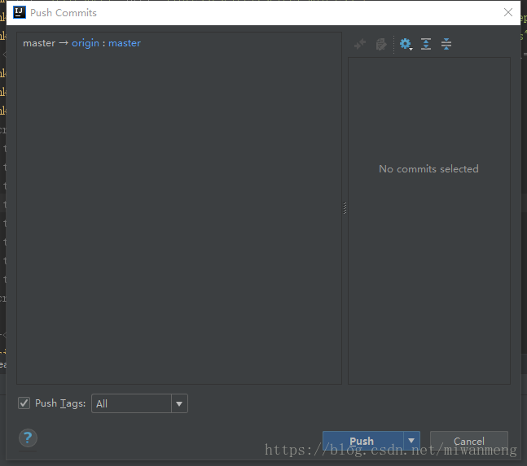
  4. 点击Push按钮完成远程仓库的更新操作。
##### GIT命令行的使用 #####
- commit message工具简介
  1. commit message的作用：
		> ● 提供更多的历史信息，方便快速浏览  
		● 过滤某些commit（比如文档改动），便于快速查找信息  
		● 直接从commit生成Change log  
		● 可读性好，清晰，不必深入看代码即可了解当前commit的作用。  
		● 为 Code Reviewing（代码审查）做准备  
		● 方便跟踪工程历史  
		● 提高项目的整体质量，提高个人工程素质  
  2. commit message的格式  
		Commit message 包括三个部分：Header，Body 和 Footer,格式如下：  
		&ensp;&ensp;`<type>(<scope>): <subject>`  
		&ensp;&ensp;`// 空一行`  
		&ensp;&ensp;`<body>`  
		&ensp;&ensp;`// 空一行`  
		&ensp;&ensp;`<footer>`  
		- 一、Header  
		Header部分只有一行，包括三个字段：type（必需）、scope（可选）和subject（必需）  
		字段描述：
			1. type  
				type用于说明 commit 的类别，只允许使用下面的标识  
				>feat：新增功能（feature）  
				fix：修补bug  
				docs：仅仅修改了文档，比如 README, CHANGELOG, CONTRIBUTE等等  
				style： 仅仅修改了空格、格式缩进、逗号等等，不改变代码逻辑  
				refactor：重构（即不是新增功能，也不是修改bug的代码变动）  
				test：增加测试，包括单元测试、集成测试等  
				chore：构建过程或辅助工具的变动  
				type：代表某次提交的类型，比如是修复一个bug还是增加一个新的feature。  
				perf: 优化相关，比如提升性能、体验  
				revert: 回滚到上一个版本  
				ci：自动化流程配置修改  
					
				>注：如果type为feat和fix，则该 commit 将肯定出现在 Change log 之中  
			2. scope
				>scope用于说明 commit 影响的范围，比如数据层、控制层、视图层等等，视项目不同而不同。
			3. subject 
				>subject是 commit 目的的简短描述，不超过50个字符。  
				以动词开头，使用第一人称现在时，比如change，而不是changed或changes  
				第一个字母小写  
				结尾不加句号（.）  
		- 二、Body  
			Body 部分是对本次 commit 的详细描述，可以分成多行
		- 三、Footer  
			Footer 部分只用于两种情况：
			1. 不兼容变动
			如果当前代码与上一个版本不兼容，则 Footer 部分以BREAKING CHANGE开头，后面是对变动的描述、以及变动理由和迁移方法
				>`BREAKING CHANGE: isolate scope bindings definition has changed.`  
				>`To migrate the code follow the example below:`  
				>`Before:`  
				>`scope: {`  
			  	>&ensp;&ensp;`myAttr: 'attribute',`  
				>`}`  
				>`After:`  
				>`scope: {`  
			  	>&ensp;&ensp;`myAttr: '@',`  
				>`}`  
				>`The removed `inject` wasn't generaly useful for directives so there should be no code using it.`  
			2. 关闭 Issue  
			如果当前commit针对某个issue，那么可以在Footer部分关闭这个issue,操作命令如下：  
			`Closes #234`  
			也可以一次关闭多个 issue，操作命令如下：   
			`Closes #123, #245, #992` 
		- 四、Revert   
			如果当前 commit 用于撤销以前的 commit，则必须以revert:开头，后面跟着被撤销 Commit 的 Header，相关操作如下：
			`revert: feat(pencil): add 'graphiteWidth' option`  
  			`This reverts commit 667ecc1654a317a13331b17617d973392f415f02.`  
			>①Body部分的格式是固定的，必须写成This reverts commit <hash>.，其中的hash是被撤销 commit 的 SHA 标识符。   
			>②如果当前 commit 与被撤销的 commit，在同一个发布（release）里面，那么它们都不会出现在 Change log 里面。如果两者在不同的发布，那么当前 commit，会出现在 Change log 的Reverts小标题下面。
- commit message工具的使用
  1. 通过npm命令对commit message进行安装，执行命令如下：  
	`npm install -g commitizen  //全局安装，模块将被下载安装到【全局目录】中`  
	`npm install  commitizen  //本地安装，则是将模块下载到当前命令行所在目录`
  2. 在项目目录下创建package.json文件，执行命令如下：  
	`npm init`  
  3. 打开项目执行如下命令：  
	`commitizen init cz-conventional-changelog --save --save-exact`  
	`//注意：如果是第二次配置，需使用--force命令：`  
	`commitizen init cz-conventional-changelog --save --force`
  4. 将未暂存文件所有变化提交到暂存区：  
	`git add . //注意: .前面必须有空格`  
	其他命令说明：
		> ① git add . ：监控工作区的状态树，使用它会把工作时的所有变化提交到暂存区，包括文件内容修改(modified)以及新文件(new)，但不包括被删除的文件。  
		> ② git add -u ：他仅监控已经被add的文件（即tracked file），他会将被修改的文件提交到暂存区。add -u 不会提交新文件（git add --update的缩写）  
		> ③ git add -a ：是上面两个功能的合集（git add --all的缩写）
  5. 执行提交命令：  
	`git cz`  
	输入命令后依次提示：  
		> ①此更改的范围是什么(例如组件或文件名)?(按回车键跳过)  
		> ②写一个简短的祈使句来描述这个变化（必填）  
		> ③提供更详细的更改说明:(按回车键跳过)  
		> ④有什么重大变化吗?(按回车键跳过)  
		> ⑤这一变化是否会影响任何未解决的问题?(按回车键跳过)
  6. 将代码推送至远程仓库，至此GIT命令提交完成，执行命令如下：  
	`git push`  
	注意：
		> ① 代码需要提测，并且自己都测试OK了，如果一次性测试通过则可以把master合并到自己的分支，然后push自己的分支，进行提测  
		> ② 代码提测了，如果有问题，把问题修改好后，再push自己的分支
- 日志打印  
  1. 输出CHANGELOG记录，（文件名称自己设置），通过以下命令，在项目中生成 CHANGELOG.md 文件
		> ①安装生成 Change log 的工具,命令如下：  
		> &ensp;&ensp;&ensp;` $ npm install -g conventional-changelog-cli`  
		> ② 通过提交记录生成 CHANGELOG.md，命令如下：  
		> &ensp;&ensp;&ensp;`$ conventional-changelog -p -i CHANGELOG.md -s`
  2. 打印出 git log 的日志记录（详细日志记录）,命令如下：  
	`git log > 文件名`
		> 例如：git log >1.txt  
		> 可在该项目路径中查看 1.txt 日志记录文件

### 代码提交原则  ###
1. 每次提交代码前，必须先进行代码更新，避免提交冲突。
2. 任何文件、代码，都不能以压缩文件的方式放入到代码仓库。
3. 原则上，应该在完成某个功能或方法的开发和修改之后，再提交代码，避免提交功能不完善的代码。
4. 提交到仓库中的代码必须能够正确编译。常见问题是添加了新的文件，但没有添加到代码仓库中，或者是只提交到了本地仓库而未提交到远程代码仓库中，导致其他成员更新代码后不能正常编译。
5. 原则上，每天工作开始时项目组成员应从远程仓库中更新最新代码到本地，然后进行开始新一天的工作；每天下班前，项目组成员必须将当天新增、修改的代码提交至远程代码仓库。并给出相应说明。
6. 项目验收后应将源代码纳入基线管理，售后的每次修改完成后，也应在基线域中建立新的版本，并在该版本中增加《版本更新说明》文件。
7. 开发人员需能链接到代码管理远程仓库服务器，必须将代码更新到该服务器对应项目的远程仓库中；若不能连接到该服务器的需在工作现场临时搭建一个代码管理仓库，且需要保证每月至少一次与正式代码管理远程仓库进行同步；若工作现场情况特殊不能与代码管理远程进行连接而导致无法按要求正常与代码仓库进行代码同步，则需要联系相关管理人员。

### 代码提交规范 ###

&ensp;&ensp;&ensp;&ensp;项目开发或实施期间，所有参与开发的技术人员，每日下班前必须将当日所编制或修改的代码按如下要求提交至远程代码管理仓库中，否则将导致代码不能自动编译和发布，由此造成的损失由该项目负责人及相关的技术人员负责。代码提交规范如下：  
1. 任何一次的提交都必须对所提交的内容进行注释。  
2. 提交注释必须包含的信息如下：  
   &ensp;&ensp;- 所属功能或模块（必须与项目实施进度计划一致）  
   &ensp;&ensp;- 性质（正常开发、修改BUG、扩展功能）  
   &ensp;&ensp;- 状态（编码中、调试通过、独测通过、联测通过）  
   &ensp;&ensp;- 更新说明（本次提交所涉及修改或新增部分的简要说明）。  
3. 所提交的源码必须是编译通过的无错的版本。  
以流程配置工具为例：  
> 新增：流程配置工具；新增流程节点基础属性及节点文书相关配置。  
> 修改bug：流程配置工具；调整流程节点基础属性及节点文书相关配置。  
> 调试：流程配置工具；与前端联调流程几点基础属性配置功能。  
> 冲突解决：由于xxx文件与本地文件出现冲突，现已解决该冲突。  
> 版本回滚：由于XXX原因导致系统崩溃，故进行版本回滚。
> 

### 代码提交审阅 ###
代码提交审阅是只项目负责人，在每天下班前审阅GIT代码管理服务器上所有下属技术人员提交的源代码及相关的技术文档。主要审阅内容如下：    
&ensp;&ensp;1. 下属技术人员是否全员按时提交相关源代码及相关技术文档。  
&ensp;&ensp;2. 所有提交是否符合要求的提交注释。  
&ensp;&ensp;3. 各个技术人员提交的内容是否与既定的项目研发进度计划安排一致。  
若审阅过程中，凡不符合上述任一条标准的，则表示当日源码提交出现异常。项目负责人应该立即进行协调，未按时提交者督促其即时提交；没有添加提交注释或注释未按要求提交者，补充提交注释；提交内容与既定项目实施进度计划安排不一致者，需进行沟通和协调，保证参与项目的技术人员的每日工作均按既定计划分步进行。