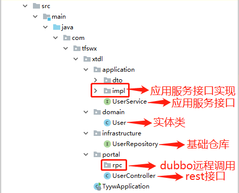

### 前言

随着项目功能增多，项目周期变短，很多时候都需要协同开发完成，高效协作即降低协同成本，提升沟通效率。所谓无规矩不成方圆，无规范不能协作。适当的规范和标准是限制过度个性化，以一种普遍认可的统一方式一起做事，提升协作效率，便于后期代码维护和新功能拓展。

### 命名风格 
1.代码中的命名不能以下划线或美元符号开始，更不能以下划线或美元符号结束。

```
反例：/ _name$  / Object$
```
2.代码中的命名严禁使用拼音与英文、或者中英文混合的方式。

说明：正确的英文拼写和语法可以让阅读者易于理解，避免歧义。注意，即使纯拼音命名方式也要避免采用。


```
正例：caseCard / CaseCardRule
反例：anka [案卡] / ankaguize [案卡规则] 
```

3.类命名使用UpperCamelCase风格，必须遵从驼峰形式，但以下情形例外：DO /DTO / VO 。

```
正例：GenerateController / DependencyRepository /  DependencyDTO
反例： generateController / ProcedureOutputDto / XMLService 
```

4.方法名、参数名、成员变量、局部变量都统一使用lowerCamelCase风格，必须遵从驼峰形式。

```
正例： getHttpMessage() / localValue / inputUserId
```

5.命令常量全部大写，单词间用下划线隔开，力求语义表达完整清楚。

```
正例：MAX_STOCK_COUNT
反例：MAX_COUNT
```

6.抽象类命名建议使用Abstract或Base开头；异常类命名使用Exception结尾;测试类命名以它要测试的类的名称开始，以 Test 结尾。

7.中括号是数组类型的一部分，数组定义如下：

```
正例：String[] array;
反例：使用 String array[]的方式来定义。
```

8.POJO 类中布尔类型的变量，都不要加is，否则部分框架解析会引起序列化错误。

```
反例：private Boolean  isDeleted;

    public Boolean getDeleted() {
      return isDeleted;
    }
    
    public void setDeleted(Boolean deleted) {
      isDeleted = deleted;
    }
```
它的方法也是isDeleted()，RPC框架在反向解析的时候，"以为"对应的属性名称是deleted，导致属性获取不到，进而抛出异常。

9.包名统一使用小写，点分隔符之间有且仅有一个自然语义的英语单词。包名统一使用单数形式，所有本公司的包名必须以"com.tfswx"开头。

```
正例： 应用工具类包名为 com.tfswx.casecard、类名为 MessageUtils（此规则参考
spring 的框架结构）
```

10.杜绝不规范的缩写，避免产生歧义。

```
反例：AbstractClass“缩写”命名成 AbsClass；
condition“缩写”命名成 condi，此类随意缩写严重降低了代码的可阅读性。
```

11.为了达到代码自解释的目标，任何自定义编程元素在命名时，使用尽量完整的单词组合来表达其意。

```
正例：从远程仓库拉取代码的类命名为 PullCodeFromRemoteRepository。
反例：变量 int a; 
```

12.如果模块、接口、类、方法使用了设计模式，在命名时须体现出具体模式。
说明：将设计模式体现在名字中，有利于后期代码维护，提高可读性。

```
正例：public class OrderFactory;
public class LoginProxy;
public class ResourceObserver;
```

13.接口类中的方法和属性不要加任何修饰符号（public也不要加），保持代码的简洁性，并加上有效的Javadoc注释。尽量不要在接口里定义变量，如果一定要定义变量，肯定是与接口方法相关，并且是整个应用的基础常量。


```
正例：接口方法签名：void f();
 接口基础常量表示：String COMPANY = "alibaba";
反例：接口方法定义：public abstract void f();
```

说明：JDK8 中接口允许有默认实现，那么这个default方法，是对所有实现类都有价值的默认实现。

14.接口和实现类的命名有两套规则：

- 对于 Service 和 DAO 类，基于 SOA的理念，暴露出来的服务一定是接口，内部
的实现类用 Impl 的后缀与接口区别。

```
正例：CacheServiceImpl 实现 CacheService 接口。
```

- 如果是形容能力的接口名称，取对应的形容词做接口名（通常是–able的形式）。

```
正例：AbstractTranslator 实现 Translatable。
```

15.枚举类名建议带上Enum后缀，枚举成员名称需要全大写，单词间用下划线隔开。

说明：枚举其实就是特殊的常量类，且构造方法被默认强制是私有。

```
正例：枚举名字为 ProcessStatusEnum 的成员名称：SUCCESS / UNKOWN_REASON。
```

### 常量定义
1.不允许任何魔法值（即未经定义的常量）直接出现在代码中。

```
反例：String key = "Id#casecard_" + number;
      cache.put(key, value);
 ```

2.long 或者 Long 初始赋值时，使用大写的 L，不能是小写的 l，小写容易跟数字 1 混淆，造成误解。

```
反例：Long count = 2l; 写的是数字的 21，还是 Long 型的 2?
正例：Long count = 2L；
```

3.不要使用一个常量类维护所有常量，按常量功能进行归类，分开维护。

说明：大而全的常量类，非得使用查找功能才能定位到修改的常量，不利于理解和维护。


```
正例：缓存相关常量放在类 CacheConsts 下；系统配置相关常量放在类 ConfigConsts 下。
```

4.常量的复用层次有五层：跨应用共享常量、应用内共享常量、子工程内共享常量、包内共享常量、类内共享常量。
-    跨应用共享常量：放置在二方库中，通常是 client.jar 中的 constant 目录下。
-    应用内共享常量：放置在一方库中，通常是 modules 中的 constant 目录下。


```
反例：易懂变量也要统一定义成应用内共享常量，两位攻城师在两个类中分别定义了表示
“是”的变量：
类 A 中：public static final String YES = "yes";
类 B 中：public static final String YES = "y";
A.YES.equals(B.YES)，预期是 true，但实际返回为 false，导致线上问题。
```

-  子工程内部共享常量：即在当前子工程的 constant 目录下。
-  包内共享常量：即在当前包下单独的 constant 目录下。
-  类内共享常量：直接在类内部 private static final 定义。

5.如果变量值仅在一个范围内变化，且带有名称之外的延伸属性，定义为枚举类。下面正例中的数字就是延伸信息，表示星期几。


```
正例：public Enum { 
    MONDAY(1), TUESDAY(2), WEDNESDAY(3), 
    THURSDAY(4), FRIDAY(5), SATURDAY(6),SUNDAY(7);
    }
```

### 代码格式
1.大括号的使用约定。如果是大括号内为空，则简洁地写成{}即可，不需要换行；如果是非空代码块则：
-  左大括号前不换行。
-  左大括号后换行。
-  右大括号前换行。
-  右大括号后还有 else 等代码则不换行；表示终止的右大括号后必须换行。

2.左小括号和字符之间不出现空格；同样，右小括号和字符之间也不出现空格。

```
反例：if (空格 a == b 空格){
        System.out.println("hello");
      }
```

3.if/for/while/switch/do 等保留字与括号之间都必须加空格。


```
正例：if (flag == 0) {
        System.out.println("hello");
      }
```

4.任何二目、三目运算符的左右两边都需要加一个空格。
说明：运算符包括赋值运算符=、逻辑运算符&&、加减乘除符号等。

5.采用 4 个空格缩进，禁止使用 tab 字符。

说明：如果使用 tab 缩进，必须设置 1 个 tab 为 4 个空格。IDEA 设置 tab 为 4 个空格时，请勿勾选 Use tab character；而在 eclipse 中，必须勾选 insert spaces for tabs。


6.注释的双斜线与注释内容之间有且仅有一个空格。

```
正例：// 注释内容，注意在//和注释内容之间有一个空格。
```

7.单行字符数限制不超过 120 个，超出需要换行，换行时遵循如下原则：

- 第二行相对第一行缩进 4 个空格，从第三行开始，不再继续缩进，参考示例。
- 运算符与下文一起换行。
- 方法调用的点符号与下文一起换行。
- 方法调用时，多个参数，需要换行时，在逗号后进行。
- 在括号前不要换行，见反例。

```
正例：
        StringBuffer sb = new StringBuffer();
        // 超过 120 个字符的情况下，换行缩进 4 个空格，点号和方法名称一起换行
        sb.append("zi").append("xin")...
            .append("huang")...
            .append("huang")...
            .append("huang");
 反例：
        StringBuffer sb = new StringBuffer();
        // 超过 120 个字符的情况下，不要在括号前换行
        sb.append("zi").append("xin")...append
        ("huang");
        // 参数很多的方法调用可能超过 120 个字符，不要在逗号前换行
        method(args1, args2, args3, ...
        , argsX);
```

8.方法参数在定义和传入时，多个参数逗号后边必须加空格。

```
正例：下例中实参的"a",后边必须要有一个空格。
method("a", "b", "c");
```

9.IDE的text file encoding 设置为 UTF-8; IDE文件的换行符使用 Unix 格式，
不要使用 Windows 格式。

10.没有必要增加若干空格来使某一行的字符与上一行对应位置的字符对齐。

```
正例：
int a = 3;
long b = 4L;
float c = 5F;
StringBuffer stringBuffer = new StringBuffer();
```

说明：增加 stringBuffer这个变量，如果需要对齐，则给a、b、c都要增加几个空格，在变量比较多的情况下，是一种累赘的事情。
11.方法体内的执行语句组、变量的定义语句组、不同的业务逻辑之间或者不同的语义之间插入一个空行。相同业务逻辑和语义之间不需要插入空行。
说明：没有必要插入多个空行进行隔开。


### OOP 规约

1.所有的覆写方法，必须加@Override注解。
说明：getObject()与get0bject()的问题。一个是字母的O，一个是数字的0，加@Override可以准确判断是否覆盖成功。另外，如果在抽象类中对方法签名进行修改，其实现类会马上编译报错。

2.相同参数类型，相同业务含义，才可以使用Java的可变参数，避免使用Object作为参数类型。

3.不能使用过时的类或方法，避免版本升级造成不必要的麻烦。

```
正例：在开发中，遇到Springboot2.0中WebMvcConfigurerAdapter过时问题，官方说明了可以使用implements WebMvcConfigurer接口替代。
```

4.Object 的 equals方法容易抛空指针异常，应使用常量或确定有值的对象来调用equals。

```
正例："test".equals(object);
反例：object.equals("test");
```
5.关于基本数据类型与包装数据类型的使用标准如下：
- 所有的 POJO 类属性必须使用包装数据类型。
- RPC 方法的返回值和参数必须使用包装数据类型。
- 所有的局部变量使用基本数据类型。

6.定义DO/DTO/VO 等 POJO 类时，不要设定任何属性默认值。


7.序列化类新增属性时，请不要修改 serialVersionUID 字段，避免反序列失败；如果完全不兼容升级，避免反序列化混乱，那么请修改 serialVersionUID 值。

说明：注意 serialVersionUID 不一致会抛出序列化运行时异常。

8.构造方法里面禁止加入任何业务逻辑，如果有初始化逻辑，请放在 init 方法中。
9.POJO 类必须写 toString 方法。使用 IDE 的中工具：source> generate toString时，如果继承了另一个 POJO 类，注意在前面加一下 super.toString。
说明：在方法执行抛出异常时，可以直接调用POJO的toString()方法打印其属性值，便于排查问题。
10.使用索引访问用 String的split方法得到的数组时，需做最后一个分隔符后有无内容的检查，否则会有抛 IndexOutOfBoundsException 的风险。

```
String str = "a,b,c,,";
String[] ary = str.split(",");
// 预期大于 3，结果是 3
System.out.println(ary.length);
```

11.当一个类有多个构造方法，或者多个同名方法，这些方法应该按顺序放置在一起，便于阅读。类内方法定义顺序依次是：公有方法或保护方法>私有方法>getter/setter方法。

说明：公有方法是类的调用者和维护者最关心的方法，首屏展示最好；保护方法虽然只是子类关心，也可能是“模板设计模式”下的核心方法；而私有方法外部一般不需要特别关心，是一个黑盒实现；因为承载的信息价值较低，所有 Service 和 DAO 的 getter/setter 方法放在类的最后。
12.setter 方法中，参数名称与类成员变量名称一致，this.成员名 = 参数名。在getter/setter 方法中，不要增加业务逻辑，增加排查问题的难度。
反例：

```
    public Integer getData() {
      if (true) {
        return this.data + 100;
      } else {
        return this.data - 100;
      }
    }
```

13.循环体内，字符串的连接方式，使用 StringBuilder 的 append 方法进行扩展。

说明：反编译出的字节码文件显示每次循环都会 new 出一个 StringBuilder 对象，然后进行append 操作，最后通过 toString 方法返回 String对象，造成内存资源浪费。

```
反例：
    String str = "start";
    for (int i = 0; i < 100; i++) {
      str = str + "hello";
    }
```

14.final 可以声明类、成员变量、方法、以及本地变量，下列情况使用 final 关键字：
- 不允许被继承的类，如：String 类。
- 不允许修改引用的域对象，如：POJO 类的域变量。
- 不允许被重写的方法，如：POJO 类的 setter 方法。
- 不允许运行过程中重新赋值的局部变量。
- 避免上下文重复使用一个变量，使用 final 描述可以强制重新定义一个变量，方便更好
地进行重构。
15.类成员与方法访问控制从严：
- 如果不允许外部直接通过 new 来创建对象，那么构造方法必须是 private。
- 工具类不允许有 public 或 default 构造方法。
- 类非 static 成员变量并且与子类共享，必须是 protected。
- 类非 static 成员变量并且仅在本类使用，必须是 private。
- 类static 成员变量如果仅在本类使用，必须是 private。
- 若是 static 成员变量，必须考虑是否为 final。
- 类成员方法只供类内部调用，必须是 private。
- 类成员方法只对继承类公开，那么限制为 protected。
说明：任何类、方法、参数、变量，严控访问范围。过于宽泛的访问范围，不利于模块解耦。


### 集合处理

1.关于 hashCode 和 equals 的处理，遵循如下规则：

- 只要重写 equals，就必须重写 hashCode。
- 因为 Set 存储的是不重复的对象，依据 hashCode 和 equals 进行判断，所以 Set 存储的对象必须重写这两个方法。
- 如果自定义对象做为 Map 的键，那么必须重写 hashCode 和 equals。
说明：String 重写了 hashCode 和 equals 方法，所以我们可以非常愉快地使用 String 对象作为 key 来使用。

2.使用工具类 Arrays.asList()把数组转换成集合时，不能使用其修改集合相关的方法，它的"add/remove/clear"方法会抛出 UnsupportedOperationException 异常。
说明：asList 的返回对象是一个Arrays内部类，并没有实现集合的修改方法。Arrays.asList体现的是适配器模式，只是转换接口，后台的数据仍是数组。

```
    String[] str = new String[] { "you", "wu" };
    List list = Arrays.asList(str);
    第一种情况：list.add("yangguanbao"); 运行时异常。
    第二种情况：str[0] = "gujin"; 那么 list.get(0)也会随之修改。
```

3.泛型通配符<? extends T>来接收返回的数据，此写法的泛型集合不能使用 add 方法，而<? super T>不能使用 get 方法，做为接口调用赋值时易出错。

说明：扩展说一下 PECS(Producer Extends Consumer Super)原则：
- 频繁往外读取内容的，适合用<? extends T>。
- 经常往里插入的，适合用<? super T>。

4.在 JDK7 版本及以上，Comparator 要满足如下三个条件，不然 Arrays.sort，
Collections.sort 会报 IllegalArgumentException 异常。
说明：三个条件如下
- x，y 的比较结果和 y，x 的比较结果相反。
- x>y，y>z，则 x>z。
- x=y，则 x，z 比较结果和 y，z 比较结果相同。

### 控制语句

1.在一个 switch块内，每个case要么通过break/return等来终止，要么注释说明程序将继续执行到哪一个case为止；在一个switch块内，都必须包含一个default语句并且放在最后，即使它什么代码也没有。


2.在 if/else/for/while/do语句中必须使用大括号。即使只有一行代码，避免采用单行的编码方式：if (condition) statements;


3.表达异常的分支时，少用 if-else 方式，这种方式可以使用策略模式、状态模式等来实现。

说明：如果非得使用if ()...else if ()...else...方式表达逻辑，为避免后续代码维护困难，请勿超过 3 层。

### 注释规约

1.对于注释的要求：
- 能够准确反应设计思想和代码逻辑；
- 能够描述业务含义，使别的程序员能够迅速了解到代码背后的信息。完全没有注释的大段代码对于阅读者形同天书，注释是给自己看的，即使隔很长时间，也能清晰理解当时的思路；注释也是给继任者看的，使其能够快速接替自己的工作。
- 好的命名、代码结构是自解释的，注释力求精简准确、表达到位。避免出现注释的一个极端：过多过滥的注释，代码的逻辑一旦修改，修改注释是相当大的负担。

2.类、类属性、类方法的注释必须使用Javadoc规范，使用

```
正例：/**
 *内容
 */
```
 格式，不得使用以下方式。

```
反例：// xxx
```

说明：在 IDE 编辑窗口中，Javadoc 方式会提示相关注释，生成 Javadoc 可以正确输出相应注释；在IDE中，工程调用方法时，不进入方法即可悬浮提示方法、参数、返回值的意义，提高阅读效率。

3.所有的抽象方法（包括接口中的方法）必须要用Javadoc注释、除了返回值、参数、异常说明外，还必须指出该方法做什么事情，实现什么功能。
说明：对子类的实现要求，或者调用注意事项，请一并说明。
4.所有的类都必须添加创建者和创建日期。

5.方法内部单行注释，在被注释语句上方另起一行，使用//注释。

6.所有的枚举类型字段必须要有注释，说明每个数据项的用途。

7.代码修改的同时，注释也要进行相应的修改，尤其是参数、返回值、异常、核心逻辑等的修改。

### 代码结构规范




