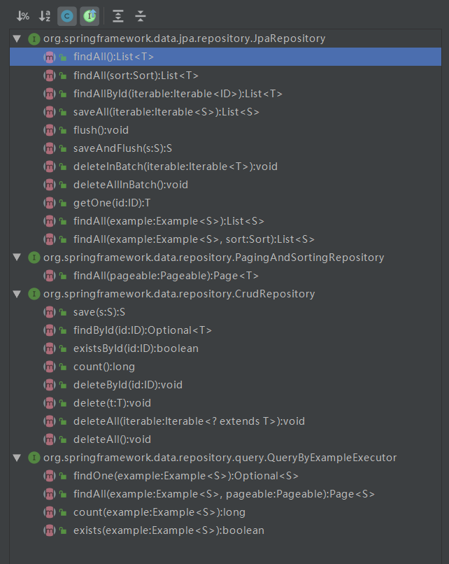

# 使用SpringData JPA进行简单增删改查

1、创建SpringBoot项目，添加相关的依赖

```
    implementation('com.github.halower:newbie-spring-boot-starter')
```

2、配置文件

```
spring:
  datasource:
    driver-class-name: oracle.jdbc.OracleDriver
    url: jdbc:oracle:thin:@192.168.6.25:1521:orcl
    username: scott
    password: tiger
  jpa:
    hibernate:
      ddl-auto: none
    show-sql: true
    properties:
      hibernate: 
        dialect: org.hibernate.dialect.OracleDialect

```

注释：spring.jpa.hibernate.ddl-auto几个属性说明：

ddl-auto: create----每次运行该程序，没有表格会新建表格，表内有数据会清空

ddl-auto: create-drop----每次程序结束的时候会清空表

ddl-auto: update----每次运行程序，没有表格会新建表格，表内有数据不会清空，只会更新

ddl-auto: validate----运行程序会校验数据与数据库的字段类型是否相同，不同会报错

ddl-auto: none

3、创建实体类

创建Book实体类：

```java
// 被Entity标注的实体类将会被JPA管理控制，在程序运行时，JPA会识别并映射到指定的数据库表
// 唯一参数name:指定实体类名称，默认为当前实体类的非限定名称。
// 若给了name属性值即@Entity(name="XXX")，则jpa在仓储层(数据层)进行自定义查询时，所查的表名应是XXX。
// 如：select s from XXX s
// 也可以使用@Table(name = "t_booK")标注该实体类对应的表名，@Entity注解中不用再加name属性
@Data
@ToString
@Entity(name = "t_book")
public class Book {
    @Id
    @GeneratedValue(strategy = GenerationType.IDENTITY)
    private Integer id;
    @Column(name = "book_name",nullable = false)
    private String name;
    private String author;
    private Float price;
    
    // @Transient注解：生成数据表时该属性被忽略
    @Transient
    private String description;
}
```

4、创建BookDao接口继承JpaRepository

```java
/**
 * 自定义BookDao继承JpaRepository，JpaRepository提供了一些基本的数据操作方法，有基本的增删改查，  分页，排序等方法
 JpaRepository<Book,Integer>中第一个参数为对应的实体类，第二个参数是对应实体类中的主键的类型
 */
@Transactional // 开启事务
public interface BookDao extends JpaRepository<Book,Integer>{
    
    // 自定义查询方法1：通过方法命名进行查询（查询作者姓名以某个字符开始的书籍）
    List<Book> getBooksByAuthorStartingWith(String author);
    
    // 自定义查询方法2：通过方法命名进行查询（查询单价大于某个值的书籍）
    List<Book> getBooksByPriceGreaterThan(Float price);
    
    // 自定义查询方法3：通过原生sql语句查询（查询id最大的书籍）
    // springdata jpa也支持自定义JPQL或原生SQL，nativeQuery = true表示使用原生SQL查询
    // 原生SQL就是说，sql语句中的表名、字段名都是使用数据库中所定义的属性，而不是实体类的属性
    @Query(value = "select * from t_book where id=(select max(id) from t_book)",nativeQuery = true)
    Book getMaxIdBook();
    
    // 自定义查询方法4：通过JPQL语句查询（根据id和author进行查询），这里默认使用的是JPQL语句；JPQL通过类名和对象属性访问，而不是表名和表的属性，这里的表名是t_book是因为在Book实体类中使用@Entity(name = "t_book")注解指定了表名
    @Query("select b from t_book b where b.id>:id and b.author=:author")
    List<Book> getBookByIdAndAuthor(@Param("author") String author, @Param("id") Integer id);
    
    // 自定义查询方法5：通过JPQL语句查询（根据id和书名进行查询）
    @Query("select b from t_book b where b.id<?2 and b.name like %?1%")
    List<Book> getBooksByIdAndName(String name, Integer id);
    
    // 注：如果BookDao中自定义的方法涉及到修改、删除操作，就要添加@Modifying注解并添加事务注解@Transactional
    // 修改
    @Modifying
    @Query("update t_book b set b.name = :name where b.id = :id")
    int modifyByName(@Param("name") String name ,@Param("id") Integer id);
    
    // 删除
    @Modifying
    @Query("delete from t_book b where b.id = ?1")
    int deleteBook(Integer id);
}
```

注意：BookDao继承JpaRepository接口，其中所包含的方法有：



5、创建BookService(为了简便这里直接创建类，不创建接口)

```java
@Service
public class BookService {
    @Autowired
    BookDao bookDao;
    
    // 保存单个实体
    public Book addBook(Book book) {
        // 使用save方法将对象数据保存到了数据表中，save方法是由JpaRepository接口提供的
        return bookDao.save(book);
    }

    // 保存多个实体
    public List<Book> addBooks(Iterable<Book> books) {
        return bookDao.saveAll(books);
    }
    
    public Page<Book> getBookByPage(Pageable pageable) {
        // 分页查询，使用findAll方法，返回值为Page<Book>,该对象中包含分页常用数据，例如总记录数，总页数，每页记录数，当前页记录数等
        return bookDao.findAll(pageable);
    }
    
    public List<Book> getBooksByAuthorStartingWith(String author){
        return bookDao.getBooksByAuthorStartingWith(author);
    }
    
    public List<Book> getBooksByPriceGreaterThan(Float price){
        return bookDao.getBooksByPriceGreaterThan(price);
    }
    
    public Book getMaxIdBook(){
        return bookDao.getMaxIdBook();
    }
    
    public List<Book> getBookByIdAndAuthor(String author, Integer id){
        return bookDao.getBookByIdAndAuthor(author, id);
    }
    
    public List<Book> getBooksByIdAndName(String name, Integer id){
        return bookDao.getBooksByIdAndName(name, id);
    }
    
    public int modifyByName(String name, Integer id) {
        return bookDao.modifyByName(name, id);
    }
    
    public int deleteBook(Integer id) {
        return bookDao.deleteBook(id);
    }
}
```

6、创建BookController,实现对数据的测试

```java
@RestController
public class BookController {
    @Autowired
    BookService bookService;
    
    @GetMapping("/findAll")
    public void findAll() {
        // 首先通过PageRequest中的of方法构造PageRequest对象，of方法接受两个参数，第一个参数是页数从0开始，第二个参数是每页显示条数
        PageRequest pageable = PageRequest.of(2, 3);
        Page<Book> page = bookService.getBookByPage(pageable);
        System.out.println("总页数:"+page.getTotalPages());
        System.out.println("总记录数:"+page.getTotalElements());
        System.out.println("查询结果:"+page.getContent());
        System.out.println("当前页数:"+(page.getNumber()+1));
        System.out.println("当前页记录数:"+page.getNumberOfElements());
        System.out.println("每页记录数:"+page.getSize());
    }
    
    @GetMapping("/search")
    public void search() {
        List<Book> bs1 = bookService.getBookByIdAndAuthor("曹雪芹", 7);
        List<Book> bs2 = bookService.getBooksByAuthorStartingWith("吴");
        List<Book> bs3 = bookService.getBooksByIdAndName("西", 8);
        List<Book> bs4 = bookService.getBooksByPriceGreaterThan(30F);
        Book b = bookService.getMaxIdBook();
        System.out.println("bs1:"+bs1);
        System.out.println("bs2:"+bs2);
        System.out.println("bs3:"+bs3);
        System.out.println("bs4:"+bs4);
        System.out.println("b:"+b);
    }
    
    @PostMapping("/save")
    public Book save() {
        Book book = new Book();
        book.setAuthor("曹雪芹");
        book.setName("红楼梦");
        book.setPrice(23F);
        return bookService.addBook(book);
    }
    
    @PostMapping("/saveAll")
    public List<Book> saveAll() {
        List<Book> list = new ArrayList<>();
        Book book1 = new Book();
        book1.setAuthor("老子");
        book1.setName("道德经");
        book1.setPrice(200F);
        
        Book book2 = new Book();
        book2.setAuthor("周文王");
        book2.setName("易经");
        book2.setPrice(200F);
        list.add(book1);
        list.add(book2);
        
        return bookService.addBooks(list);
    }
    
    @PutMapping("/update")
    public void updateBook() {
        String name = "彷徨";
        Integer id = 1;
        int res = bookService.modifyByName(name, 1);
        System.out.println(res);
    }

    @DeleteMapping("/delete")
    public void deleteBook() {
        Integer id = 1;
        int res = bookService.deleteBook(id);
        System.out.println(res);
    }
}

```


SpringData JPA方法命名规则：

1、简单条件查询

简单条件查询：查询某一个实体类或者集合。
 按照Spring Data的规范的规定，查询方法以find | read | get开头（比如 find、findBy、read、readBy、get、getBy），涉及查询条件时，条件的属性用条件关键字连接，要注意的是：条件属性以首字母大写。框架在进行方法名解析时，会先把方法名多余的前缀截取掉，然后对剩下部分进行解析。
 直接在接口中定义查询方法，如果是符合规范的，可以不用写实现，即不用写SQL，目前支持的关键字写法如下：

| 关键字            | **SQL符号**         | 方法命名                    | sql where字句              |
| ----------------- | ------------------- | --------------------------- | -------------------------- |
| And               | and                 | findByNameAndPwd            | where name= ? and pwd =?   |
| Or                | or                  | findByNameOrSex             | where name= ? or sex=?     |
| Is,Equals         | =                   | findById,findByIdEquals     | where id= ?                |
| Between           | between xx and xx   | findByIdBetween             | where id between ? and ?   |
| LessThan          | <                   | findByIdLessThan            | where id < ?               |
| LessThanEquals    | <=                  | findByIdLessThanEquals      | where id <= ?              |
| GreaterThan       | >                   | findByIdGreaterThan         | where id > ?               |
| GreaterThanEquals | >=                  | findByIdGreaterThanEquals   | where id > = ?             |
| After             | >                   | findByIdAfter               | where id > ?               |
| Before            | <                   | findByIdBefore              | where id < ?               |
| IsNull            | is null             | findByNameIsNull            | where name is null         |
| isNotNull,NotNull | is not null         | findByNameNotNull           | where name is not null     |
| Like              | like                | findByNameLike              | where name like ?          |
| NotLike           | not like            | findByNameNotLike           | where name not like ?      |
| StartingWith      | like 'xxx%'         | findByNameStartingWith      | where name like '?%'       |
| EndingWith        | like 'xxx%'         | findByNameEndingWith        | where name like '%?'       |
| Containing        | like '%xxx%'        | findByNameContaining        | where name like '%?%'      |
| OrderBy           | order by            | findByIdOrderByXDesc        | where id=? order by x desc |
| Not               | <>                  | findByNameNot               | where name <> ?            |
| In                | in()                | findByIdIn(Collection<?> c) | where id in (?)            |
| NotIn             | not in()            | findByNameNot               | where name <> ?            |
| True              | =true               | findByAaaTue                | where aaa = true           |
| False             | =false              | findByAaaFalse              | where aaa = false          |
| IgnoreCase        | upper(xx)=upper(yy) | findByNameIgnoreCase        | where UPPER(name)=UPPER(?) |


2、查询方法解析流程

假如我们创建如下的查询：findByUserDepUuid(),框架在解析该方法时，首先剔除findBy，然后对剩下的属性进行解析，假设查询实体为Doc。

1. 先判断userDepUuid (根据POJO（Plain Ordinary Java Object简单java对象，实际就是普通java bean）规范，首字母变为小写。)是否是查询实体的一个属性，如果根据该属性进行查询；如果没有该属性，继续第二步。
2. 从右往左截取第一个大写字母开头的字符串(此处为Uuid)，然后检查剩下的字符串是否为查询实体的一个属性，如果是，则表示根据该属性进行查询；如果没有该属性，则重复第二步，继续从右往左截取；最后假设 user为查询实体的一个属性。
3. 接着处理剩下部分（DepUuid），先判断user所对应的类型是否有depUuid属性，如果有，则表示该方法最终是根据 “Doc.user.depUuid” 的取值进行查询；否则继续按照步骤 2的规则从右往左截取，最终表示根据“Doc.user.dep.uuid” 的值进行查询。
4. 可能会存在一种特殊情况，比如 Doc包含一个user的属性，也有一个 userDep 属性，此时会存在混淆。可以明确在属性之间加上 "_"以显式表达意图，比如"findByUser_DepUuid()" 或者"findByUserDep_uuid()"。

   

3、**命名规则不适合动态查询**

当查询条件为null时，如

- 实体定义：对于一个客户实体Cus,包含有name和gender，均是String类型。
- 查询方法定义：List<Cus> findByNameAndGender(String name,String gender);
- 使用时：dao.findByNameAndGender(null, "男");
- 后台生成sql片断：where (cus0_.name is null) and cus0_.gender=?

结论：当查询时传值是null时，数据库中只有该字段是null的记录才符合条件，并不是说忽略这个条件。也就是说，这种查询方式，只适合于明确查询条件必须传的业务，对于动态查询（条件多少是动态的，例如一般的查询列表，由最终用户使用时决定输入那些查询条件），这种简单查询是不能满足要求的。

强调：需要强调的是，**命名规则也不适合delete  insert  update.   只适合简单查询**