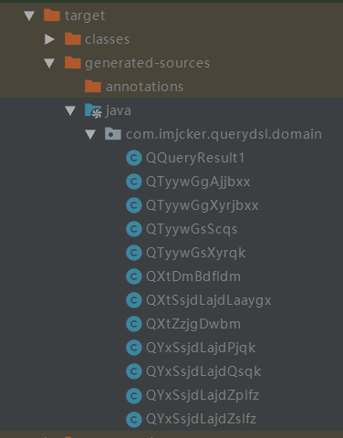

# 使用QueryDSL进行高级查询

1、创建springboot项目，添加相关依赖和插件

```xml
<dependencies>
    <dependency>
        <groupId>org.springframework.boot</groupId>
        <artifactId>spring-boot-starter-data-jpa</artifactId>
    </dependency>

    <!--query dsl ${querydsl.version}-->
    <dependency>
        <groupId>com.querydsl</groupId>
        <artifactId>querydsl-apt</artifactId>
        <version>4.2.1</version>
        <scope>provided</scope>
    </dependency>
    <dependency>
        <groupId>com.querydsl</groupId>
        <artifactId>querydsl-jpa</artifactId>
        <version>4.2.1</version>
    </dependency>
</dependencies>


<build>
    <plugins>
        <plugin>
            <groupId>org.springframework.boot</groupId>
            <artifactId>spring-boot-maven-plugin</artifactId>
        </plugin>

        <!--该插件可以生成querysdl需要的查询对象，执行mvn compile即可-->
        <plugin>
            <groupId>com.mysema.maven</groupId>
            <artifactId>apt-maven-plugin</artifactId>
            <version>1.1.3</version>
            <executions>
                <execution>
                   <goals>
                     <goal>process</goal>
                   </goals>
                   <configuration>
                     <outputDirectory>target/generated-sources/java</outputDirectory>
                     <processor>com.querydsl.apt.jpa.JPAAnnotationProcessor</processor>
                   </configuration>
                </execution>
            </executions>
        </plugin>
    </plugins>
</build>

```

注：QueryDSL的插件的作用：该插件会自动扫描项目内配置了@Entity的实体类，并根据实体的内定义的字段以及关联类通过JPAAnnotationProcessor自动创建Q[实体类名称]的查询实体，创建完成后会将实体存放到我们配置outputDirectory属性目录下。


2、配置文件

```yml
spring:
  datasource:
    driver-class-name: oracle.jdbc.driver.OracleDriver
    url: jdbc:oracle:thin:@192.168.1.241:1521:jcydb
    username: tyyw
    password: tyyw

  jpa:
    hibernate:
      ddl-auto: none
    show-sql: true # 打印SQL语句

#数据库方言
    properties:
      hibernate:
        dialect: org.hibernate.dialect.Oracle10gDialect
```

注：spring.jpa.hibernate.ddl-auto几个属性说明：

ddl-auto: create----每次运行该程序，没有表格会新建表格，表内有数据会清空

ddl-auto: create-drop----每次程序结束的时候会清空表

ddl-auto: update----每次运行程序，没有表格会新建表格，表内有数据不会清空，只会更新

ddl-auto: validate----运行程序会校验数据与数据库的字段类型是否相同，不同会报错

ddl-auto: none


3、创建实体类

```java
实体类大致有以下几类，具体内容就不一一罗列
TyywGgAjjbxx 
TyywGgXyrjbxx
TyywGsScqs
TyywGsXyrqk
XtZzjgDwbm
YxSsjdLajdPjqk
YxSsjdLajdQsqk
YxSsjdLajdZslfz
XtDmBdfldm
```


4、运行maven的compile生成实体类对应的Q[实体类名称]的查询实体




5、创建Repository接口继承JpaRepository、JpaSpecificationExecutor、QuerydslPredicateExecutor接口

```java
// 以TyywGgAjjbxx这个实体类为例，其余实体类相同，JpaRepository泛型中第一个参数为实体类，第二个参数是实体类中主键的类型
public interface TyywGgAjjbxxRepository extends 
    JpaRepository<TyywGgAjjbxx, String>,
    JpaSpecificationExecutor<TyywGgAjjbxx>,
    QuerydslPredicateExecutor<TyywGgAjjbxx> {
    
}
```


6、service和controller省略，根据自己需要进行编写；这里直接测试

```java
@RunWith(SpringRunner.class)
@SpringBootTest(classes = QueryDslApplication.class)
public class QueryApplicationTests {

    // JPA查询工厂
	@Autowired
	private JPAQueryFactory jpaQueryFactory;
	
    // 各实体类对应的Repository
	@Autowired
	private TyywGgAjjbxxRepository tyywGgAjjbxxRepository;

	@Autowired
	private TyywGgXyrjbxxRepository tyywGgXyrjbxxRepository;

	@Autowired
	private TyywGsScqsRepository tyywGsScqsRepository;

	@Autowired
	private TyywGsXyrqkRepository tyywGsXyrqkRepository;

	@Autowired
	private XtZzjgDwbmRepository xtZzjgDwbmRepository;

	@Autowired
	private YxSsjdLajdPjqkRepository yxSsjdLajdPjqkRepository;

	@Autowired
	private YxSsjdLajdQsqkRepository yxSsjdLajdQsqkRepository;

	@Autowired
	private YxSsjdLajdZslfzRepository yxSsjdLajdZslfzRepository;

    
    
	@Test
	public void findOneAjjbxx() {
		QTyywGgAjjbxx tyywGgAjjbxx = QTyywGgAjjbxx.tyywGgAjjbxx;

		TyywGgAjjbxx aj = new TyywGgAjjbxx();
		aj =  jpaQueryFactory
				.selectFrom(tyywGgAjjbxx)
				.where(tyywGgAjjbxx.bmsah.eq("深龙检起诉受[2014]44030700008号"))
				.fetchOne(); // 获取一条

		System.out.println(aj); 
	}
    
    
    // 分页测试
    @Test
    public void findAjjbxxByPage() {
        // 分页信息设置
        Pageable pageable = new Pageable() {
            @Override
            public int getPageNumber() {
                return 0;
            }

            @Override
            public int getPageSize() {
                return 2;
            }

            @Override
            public long getOffset() {
                return 2;
            }

            @Override
            public Sort getSort() {
                return null;
            }

            @Override
            public Pageable next() {
                return null;
            }

            @Override
            public Pageable previousOrFirst() {
                return null;
            }

            @Override
            public Pageable first() {
                return null;
            }

            @Override
            public boolean hasPrevious() {
                return false;
            }
        };

        // 注意：如果使用的是Oracle数据库，需要配置数据库方言，如果不配置数据库方言，offset limit生成的分页语句为：offset ? rows fetch next ? rows only；该语法只在oracle12c及以上版本中被支持，其余版本不支持
        QueryResults<TyywGgAjjbxx> results = jpaQueryFactory
                .selectFrom(tyywGgAjjbxx)
                .where(tyywGgAjjbxx.tysah.eq("44030520140000100"))
                .offset(pageable.getOffset()) // offset-起始页
                .limit(pageable.getPageSize()) // limlt-每页大小
                .fetchResults(); // 获取结果集
        System.out.println(results.getOffset());
        System.out.println(results.getLimit());
        System.out.println(results.getTotal());
        System.out.println(results.isEmpty());
        System.out.println(results.getResults()); 
    }
}
```

注意：**如果使用的是Oracle数据库，需要配置数据库方言**，如果不配置数据库方言，offset-limit生成的分页语句为：offset ? rows fetch next ? rows only；该语法只在oracle12c及以上版本中被支持，其余版本不支持


使用QueryDSL进行复杂查询：

复杂查询sql语句举例：

```sql
SELECT sum(t.baxl) baxl, t.spdw_dm, t.spdw_mc 
FROM (SELECT spzl.bjs / bazl.zl baxl, spzl.spdw_dm, spzl.spdw_mc
      FROM(SELECT count(1) bjs, zb.spdw_dm, zb.spdw_mc
           FROM (select
                    la.*,
                    YSHXKYQ,--一审缓刑考验期
                    xyrqk.sjclqk_mc,--审查处理结果
                    xyrqk.YSXGX_DM,--主刑情况（主刑刑种）
                    xyrqk.YSXGX_MC,--主刑情况（主刑刑种）
                    xyrqk.YSXGXXQ,--主刑刑期
                    xyrqk.Sffycqlxjy,--是否采纳量刑建议
                    qsqk.sfgbzcjgdx_dm, -- 改变侦查机关定性
                    qsqk.sfgbzcjgdx_mc,--改变侦查机关定性
                    pjqk.sfgbdx_dm, --改变起诉定性
                    pjqk.sfgbdx_mc, --改变起诉定性
                    pjqk.pjsrdssbhqk_dm, --判决书认定事实变化情况
                    pjqk.pjsrdlxqjbhqk_dm, --判决书认定的量刑情节变化情况
                    pjqk.spdw_dm,--审判单位编码
                    pjqk.spdw_mc,--审判单位
                    scqs.sjqk_dm,--审结情况代码
                    scqs.sjqk_mc,--审结情况名称
                    xyr.xm,--嫌疑人姓名
                    ajxx.ajmc,ajxx.slrq,ajxx.wcrq,ajxx.cbr
                from YX_SSJD_LAJD_ZSLFZ la,
                     tyyw_gs_xyrqk xyrqk,
                     tyyw_gg_xyrjbxx xyr,
                     tyyw_gs_scqs scqs,
                     tyyw_gg_ajjbxx ajxx,
                     yx_ssjd_lajd_qsqk qsqk,
                     yx_ssjd_lajd_pjqk pjqk
                where (la.bmsah = xyrqk.bmsah AND la.xyrbh=xyrqk.xyrbh and xyrqk.sfsc='N')
                          and
                            la.sfsc='N'
                          and
                            (la.bmsah=scqs.bmsah AND scqs.sfsc='N')
                          and
                            (la.bmsah = xyr.bmsah and la.xyrbh=xyr.xyrbh)
                          and
                            (la.bmsah=ajxx.bmsah AND ajxx.sfsc='N')
                          and
                            (la.bmsah = qsqk.bmsah(+) AND la.xyrbh=qsqk.xyrbh(+) AND qsqk.sfsc(+) ='N')
                          and
                            (la.bmsah = pjqk.bmsah(+) AND la.xyrbh=pjqk.xyrbh(+) AND pjqk.sfsc(+) ='N')
                
                ) zb
          WHERE zb.spdw_dm is not null and zb.cbdw_bm in (SELECT dwbm FROM xt_zzjg_dwbm start with dwbm = 440300 connect by prior dwbm = fdwbm) 
          group by zb.spdw_dm, zb.spdw_mc) spzl 
          left join 
       (SELECT count(1) zl, zb.spdw_dm, zb.spdw_mc
          FROM ( 
                  select
                    la.*,
                    YSHXKYQ,--一审缓刑考验期
                    xyrqk.sjclqk_mc,--审查处理结果
                    xyrqk.YSXGX_DM,--主刑情况（主刑刑种）
                    xyrqk.YSXGX_MC,--主刑情况（主刑刑种）
                    xyrqk.YSXGXXQ,--主刑刑期
                    xyrqk.Sffycqlxjy,--是否采纳量刑建议
                    qsqk.sfgbzcjgdx_dm, -- 改变侦查机关定性
                    qsqk.sfgbzcjgdx_mc,--改变侦查机关定性
                    pjqk.sfgbdx_dm, --改变起诉定性
                    pjqk.sfgbdx_mc, --改变起诉定性
                    pjqk.pjsrdssbhqk_dm, --判决书认定事实变化情况
                    pjqk.pjsrdlxqjbhqk_dm, --判决书认定的量刑情节变化情况
                    pjqk.spdw_dm,--审判单位编码
                    pjqk.spdw_mc,--审判单位
                    scqs.sjqk_dm,--审结情况代码
                    scqs.sjqk_mc,--审结情况名称
                    xyr.xm,--嫌疑人姓名
                    ajxx.ajmc,ajxx.slrq,ajxx.wcrq,ajxx.cbr
                     from YX_SSJD_LAJD_ZSLFZ la,
                          tyyw_gs_xyrqk xyrqk,
                          tyyw_gg_xyrjbxx xyr,
                          tyyw_gs_scqs scqs,
                          tyyw_gg_ajjbxx ajxx,
                          yx_ssjd_lajd_qsqk qsqk,
                          yx_ssjd_lajd_pjqk pjqk
                      where (la.bmsah = xyrqk.bmsah AND la.xyrbh=xyrqk.xyrbh and xyrqk.sfsc='N')
                          and
                            la.sfsc='N'
                          and
                            (la.bmsah=scqs.bmsah AND scqs.sfsc='N')
                          and
                            (la.bmsah = xyr.bmsah and la.xyrbh=xyr.xyrbh)
                          and
                            (la.bmsah=ajxx.bmsah AND ajxx.sfsc='N')
                          and
                            (la.bmsah = qsqk.bmsah(+) AND la.xyrbh=qsqk.xyrbh(+) AND qsqk.sfsc(+) ='N')
                          and
                            (la.bmsah = pjqk.bmsah(+) AND la.xyrbh=pjqk.xyrbh(+) AND pjqk.sfsc(+) ='N')
                
               ) zb where zb.cbdw_bm in (SELECT dwbm FROM xt_zzjg_dwbm start with dwbm = 440300 connect by prior dwbm = fdwbm) 
         AND zb.sjqk_dm = 0322110101000
           and zb.spdw_dm is not null
         group by zb.spdw_dm, zb.spdw_mc) bazl 
         on spzl.spdw_dm = bazl.spdw_dm
         
         union 
         
         select 0 baxl, dm spdw_dm, mc spdw_mc from XT_DM_BDFLDM where lbbm='4403001035') t group by t.spdw_dm, t.spdw_mc ;

```


上述sql语句太过复杂，嵌套查询太多，且不推荐使用(+)这种连接方式，对上述sql语句进行简化，去掉多余的字段

```sql

SELECT sum(t.baxl) baxl, t.spdw_dm, t.spdw_mc 
FROM (
       SELECT spzl.bjs / bazl.zl baxl, spzl.spdw_dm, spzl.spdw_mc
       FROM (
              select count(pjqk.spdw_dm) bjs,
                     pjqk.spdw_dm,--审判单位编码
                     pjqk.spdw_mc--审判单位
              from YX_SSJD_LAJD_ZSLFZ la
              inner join tyyw_gs_xyrqk xyrqk on la.bmsah = xyrqk.bmsah AND la.xyrbh = xyrqk.xyrbh
              inner join tyyw_gg_xyrjbxx xyr on la.bmsah = xyr.bmsah and la.xyrbh = xyr.xyrbh
              inner join tyyw_gs_scqs scqs on la.bmsah = scqs.bmsah
              inner join tyyw_gg_ajjbxx ajxx on la.bmsah = ajxx.bmsah
              left join yx_ssjd_lajd_qsqk qsqk on la.bmsah = qsqk.bmsah AND la.xyrbh = qsqk.xyrbh
              left join yx_ssjd_lajd_pjqk pjqk on la.bmsah = pjqk.bmsah AND la.xyrbh = pjqk.xyrbh
              where la.sfsc = 'N'
                and xyrqk.sfsc = 'N'
                and scqs.sfsc = 'N'
                and ajxx.sfsc = 'N'
                and qsqk.sfsc = 'N'
                and pjqk.sfsc = 'N'
                and pjqk.spdw_dm is not null
                and la.cbdw_bm in (SELECT dwbm FROM xt_zzjg_dwbm where dwbm like '4403%')
              group by pjqk.spdw_dm, pjqk.spdw_mc
             ) spzl 
             
    
             left join 
          
    
             (select count(pjqk.spdw_dm) zl,
                     pjqk.spdw_dm,--审判单位编码
                     pjqk.spdw_mc--审判单位
              from YX_SSJD_LAJD_ZSLFZ la
              inner join tyyw_gs_xyrqk xyrqk on la.bmsah = xyrqk.bmsah AND la.xyrbh = xyrqk.xyrbh
              inner join tyyw_gg_xyrjbxx xyr on la.bmsah = xyr.bmsah and la.xyrbh = xyr.xyrbh
              inner join tyyw_gs_scqs scqs on la.bmsah = scqs.bmsah
              inner join tyyw_gg_ajjbxx ajxx on la.bmsah = ajxx.bmsah
              left join yx_ssjd_lajd_qsqk qsqk on la.bmsah = qsqk.bmsah AND la.xyrbh = qsqk.xyrbh
              left join yx_ssjd_lajd_pjqk pjqk on la.bmsah = pjqk.bmsah AND la.xyrbh = pjqk.xyrbh
              where la.sfsc = 'N'
                and xyrqk.sfsc = 'N'
                and scqs.sfsc = 'N'
                and ajxx.sfsc = 'N'
                and qsqk.sfsc = 'N'
                and pjqk.sfsc = 'N'
                and pjqk.spdw_dm is not null
                and la.cbdw_bm in (SELECT dwbm FROM xt_zzjg_dwbm where dwbm like '4403%')
                and scqs.sjqk_dm = 0322110101000
              group by pjqk.spdw_dm, pjqk.spdw_mc
          ) bazl 
             
      on spzl.spdw_dm = bazl.spdw_dm
         
    
      union 
         
    
      select 0 baxl, dm spdw_dm, mc spdw_mc 
      from XT_DM_BDFLDM 
      where lbbm = '4403001035'
) t 
group by t.spdw_dm, t.spdw_mc
```


简化后的sql语句仍然有from中存在子查询这种情况，由于**queryDSL不支持from中存在子查询，和union/union all**这种情况，因此，需要对该sql语句进行拆分查询，然后再计算并组合结果。

```sql
--将上述sql进行拆分为3部分：
--第1部分:
select count(pjqk.spdw_dm) bjs,
                     pjqk.spdw_dm,--审判单位编码
                     pjqk.spdw_mc--审判单位
              from YX_SSJD_LAJD_ZSLFZ la
              inner join tyyw_gs_xyrqk xyrqk on la.bmsah = xyrqk.bmsah AND la.xyrbh = xyrqk.xyrbh
              inner join tyyw_gg_xyrjbxx xyr on la.bmsah = xyr.bmsah and la.xyrbh = xyr.xyrbh
              inner join tyyw_gs_scqs scqs on la.bmsah = scqs.bmsah
              inner join tyyw_gg_ajjbxx ajxx on la.bmsah = ajxx.bmsah
              left join yx_ssjd_lajd_qsqk qsqk on la.bmsah = qsqk.bmsah AND la.xyrbh = qsqk.xyrbh
              left join yx_ssjd_lajd_pjqk pjqk on la.bmsah = pjqk.bmsah AND la.xyrbh = pjqk.xyrbh
              where la.sfsc = 'N'
                and xyrqk.sfsc = 'N'
                and scqs.sfsc = 'N'
                and ajxx.sfsc = 'N'
                and qsqk.sfsc = 'N'
                and pjqk.sfsc = 'N'
                and pjqk.spdw_dm is not null
                and la.cbdw_bm in (SELECT dwbm FROM xt_zzjg_dwbm where dwbm like '4403%')
              group by pjqk.spdw_dm, pjqk.spdw_mc
              
              
              
              
--第2部分:
select count(pjqk.spdw_dm) zl,
                     pjqk.spdw_dm,--审判单位编码
                     pjqk.spdw_mc--审判单位
              from YX_SSJD_LAJD_ZSLFZ la
              inner join tyyw_gs_xyrqk xyrqk on la.bmsah = xyrqk.bmsah AND la.xyrbh = xyrqk.xyrbh
              inner join tyyw_gg_xyrjbxx xyr on la.bmsah = xyr.bmsah and la.xyrbh = xyr.xyrbh
              inner join tyyw_gs_scqs scqs on la.bmsah = scqs.bmsah
              inner join tyyw_gg_ajjbxx ajxx on la.bmsah = ajxx.bmsah
              left join yx_ssjd_lajd_qsqk qsqk on la.bmsah = qsqk.bmsah AND la.xyrbh = qsqk.xyrbh
              left join yx_ssjd_lajd_pjqk pjqk on la.bmsah = pjqk.bmsah AND la.xyrbh = pjqk.xyrbh
              where la.sfsc = 'N'
                and xyrqk.sfsc = 'N'
                and scqs.sfsc = 'N'
                and ajxx.sfsc = 'N'
                and qsqk.sfsc = 'N'
                and pjqk.sfsc = 'N'
                and pjqk.spdw_dm is not null
                and la.cbdw_bm in (SELECT dwbm FROM xt_zzjg_dwbm where dwbm like '4403%')
                and scqs.sjqk_dm = 0322110101000
              group by pjqk.spdw_dm, pjqk.spdw_mc
              
              
              
--第3部分:
select 0 baxl, dm spdw_dm, mc spdw_mc 
      from XT_DM_BDFLDM 
      where lbbm = '4403001035'


```


查询之前先要建立一个DTO实体类：该实体类的字段包含sql语句中所涉及的字段

```java
@Data
@AllArgsConstructor
@NoArgsConstructor
public class OutDTO implements Serializable {
    private String spdwDm; // 单位编码
    private String spdwMc; // 单位名称
    private Long zl; // 办案总量
    private Long bjs; // 办结数量
    private Double baxl; // 办案效率

    // 重写equals方法，根据spdwDm和spdwMc进行判断是否是同一对象，目的是用于合并
    // 请根据具体业务需要进行重写！！！
    @Override
    public boolean equals(Object o) {
        if (this == o) return true;
        if (o == null || getClass() != o.getClass()) return false;
        OutDTO outDTO = (OutDTO) o;
        return Objects.equals(spdwDm, outDTO.spdwDm) &&
                Objects.equals(spdwMc, outDTO.spdwMc);
    }

    @Override
    public int hashCode() {
        return Objects.hash(spdwDm, spdwMc);
    }

    // 自定义合并方法
    // 例如：查询到有两条记录： 
    //   spdwDm（单位编码）  spdwMc（单位名称） zl（办案总量） bjs（办结数） baxl（办案效率）
    //        001                高检            3           3            1
    //        001                高检            2           2            1
    // 合并之后为：
    //        001                高检            5           5            1 
    
    // 请根据具体业务需要创建方法
    public static OutDTO merge(OutDTO o1, OutDTO o2) {
        if (!o1.equals(o2)) {
            throw new IllegalArgumentException ();
        }
        return new OutDTO(o1.spdwDm, o1.spdwMc, o1.bjs + o2.bjs, o1.zl + o2.zl, new BigDecimal((float)(o1.bjs + o2.bjs)/(o1.zl + o2.zl).setScale(2, BigDecimal.ROUND_HALF_UP).doubleValue()));
    }
}
```


测试代码：

```java
@Test
    public void test5() {
        QTyywGgAjjbxx ajxx = QTyywGgAjjbxx.tyywGgAjjbxx;
        QTyywGgXyrjbxx xyr = QTyywGgXyrjbxx.tyywGgXyrjbxx;
        QTyywGsScqs scqs = QTyywGsScqs.tyywGsScqs;
        QTyywGsXyrqk xyrqk = QTyywGsXyrqk.tyywGsXyrqk;
        QXtZzjgDwbm dw = QXtZzjgDwbm.xtZzjgDwbm;
        QYxSsjdLajdPjqk pjqk = QYxSsjdLajdPjqk.yxSsjdLajdPjqk;
        QYxSsjdLajdQsqk qsqk = QYxSsjdLajdQsqk.yxSsjdLajdQsqk;
        QYxSsjdLajdZslfz la = QYxSsjdLajdZslfz.yxSsjdLajdZslfz;
        QXtDmBdfldm dm = QXtDmBdfldm.xtDmBdfldm;
        QQueryResult1 qr = QQueryResult1.queryResult1;

        // 1:查询办结数（对应上述sql语句的第1部分）
        List<OutDTO> bjsList = jpaQueryFactory.select(
            Projections.bean( // 使用Projections.out返回自定义实体的类,如果没有自定义的实体类，则不能使用Projections.out()
                OutDTO.class, // OutDTO中的 zl、baxl在这里没有查询，查询结果中为null
                pjqk.spdwMc,
                pjqk.spdwDm.count().as("bjs"), // 使用别名和OutDTO中的属性对应
                pjqk.spdwDm))
           .from(la)
           .innerJoin(xyrqk).on(la.bmsah.eq(xyrqk.bmsah).and(la.xyrbh.eq(xyrqk.xyrbh)))
           .innerJoin(xyr).on(la.bmsah.eq(xyr.bmsah).and(la.xyrbh.eq(xyr.xyrbh)))
           .innerJoin(scqs).on(la.bmsah.eq(scqs.bmsah))
           .innerJoin(ajxx).on(la.bmsah.eq(ajxx.bmsah))
           .leftJoin(qsqk).on(la.bmsah.eq(qsqk.bmsah).and(la.xyrbh.eq(qsqk.xyrbh)))
           .leftJoin(pjqk).on(la.bmsah.eq(pjqk.bmsah).and(la.xyrbh.eq(pjqk.xyrbh)))
           .where(la.sfsc.eq("N")
           .and(xyrqk.sfsc.eq("N"))
           .and(scqs.sfsc.eq("N"))
           .and(ajxx.sfsc.eq("N"))
           .and(qsqk.sfsc.eq("N"))
           .and(pjqk.sfsc.eq("N"))
           .and(pjqk.spdwDm.isNotNull())
           .and(la.cbdwBm.in(JPAExpressions.select(dw.dwbm) // where子句中的子查询
                                .from(dw)
                                .where(dw.dwbm.startsWith("4403"))))
                ).groupBy(pjqk.spdwDm, pjqk.spdwMc)
           .fetch();

        System.out.println("办结" + bjsList);

        // 2:查询办案总量(对应上述sql语句的第2部分)
		List<OutDTO> zlList = jpaQueryFactory.select(
			Projections.bean(
                OutDTO.class, 
                pjqk.spdwMc,
                pjqk.spdwDm.count().as("zl"), 
                pjqk.spdwDm))
		.from(la)
        .innerJoin(xyrqk).on(la.bmsah.eq(xyrqk.bmsah).and(la.xyrbh.eq(xyrqk.xyrbh)))
		.innerJoin(xyr).on(la.bmsah.eq(xyr.bmsah).and(la.xyrbh.eq(xyr.xyrbh)))
		.innerJoin(scqs).on(la.bmsah.eq(scqs.bmsah))
		.innerJoin(ajxx).on(la.bmsah.eq(ajxx.bmsah))
		.leftJoin(qsqk).on(la.bmsah.eq(qsqk.bmsah).and(la.xyrbh.eq(qsqk.xyrbh)))
		.leftJoin(pjqk).on(la.bmsah.eq(pjqk.bmsah).and(la.xyrbh.eq(pjqk.xyrbh)))
		.where(la.sfsc.eq("N")
		.and(xyrqk.sfsc.eq("N"))
		.and(scqs.sfsc.eq("N"))
        .and(ajxx.sfsc.eq("N"))
        .and(qsqk.sfsc.eq("N"))
        .and(pjqk.sfsc.eq("N"))
        .and(pjqk.spdwDm.isNotNull())
        .and(scqs.sjqkDm.eq("0322110101000"))
        .and(la.cbdwBm.in(JPAExpressions.select(dw.dwbm) // where子句中的子查询
                             .from(dw)
                             .where(dw.dwbm.startsWith("4403")))))
        .groupBy(pjqk.spdwDm, pjqk.spdwMc)
        .fetch();
        
		System.out.println("总量" + zlList);

        // 3:查询union的这一部分(对应上述sql语句的第3部分)
		List<OutDTO> exrList = jpaQueryFactory.select(
				Projections.bean( 
						OutDTO.class, 
						dm.dm.as("spdwDm"),
						dm.mc.as("spdwMc"))
				)
				.from(dm)
				.where(dm.lbbm.eq("4403001035"))
				.fetch();
		System.out.println(exrList);

        
        // 计算办案效率
		for (OutDTO out : bjsList) {
			for (OutDTO out2 : zlList) {
				if (out.getSpdwDm().equals(out2.getSpdwDm())) { // 调用重写的equals方法
					out.setZl(out2.getZl());
					out.setBaxl((double) (new BigDecimal((float)out.getBjs() / out2.getZl()).setScale(2, BigDecimal.ROUND_HALF_UP).doubleValue()));
				}
			}
		}
        
		System.out.println(bjsList + "================");

		bjsList.addAll(exrList);

		System.out.println(bjsList);
		System.out.println(bjsList.size());

        // 合并
		Map<OutDTO, OutDTO> map = new HashMap<>();
		for (OutDTO o : bjsList) {
			if (o.getZl() == null) {
				o.setZl((long) 0);
			}
			if (o.getBaxl() == null) {
				o.setBaxl((double) 0);
			}
			if (o.getBjs() == null) {
				o.setBjs((long) 0);
			}
			if (map.containsKey(o)) {
				map.put(o, OutDTO.merge(o, map.get(o))); // 调用自定义的合并方法
			} else {
				map.put(o, o);
			}
		}
		System.out.println(map.values());
		System.out.println(map.values().size());
	}
```


