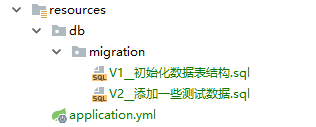
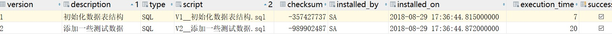

# 数据库版本控制

?> `NEWBIE`集成了`flyway`来管理数据库版本，默认为开启迁移功能，因此如果你想关闭数据迁移功能可以直接关闭配置`spring.flyway.enabled=false`.

## 为什么要进行数据版本控制
理想的情况下，在开发新项目的时候会首先把业务理清楚，把数据库表设计好，然后将数据库交给专门的人员维护，也就不存在数据库同步的问题了。但实际情况呢需求从项目开始到项目结束一直在变，公司没有专门的数据库维护人员，数据库大家都在操作，都在修改，如果团队之间沟通及时还好，大家每次更新代码后顺便也更新一下数据库，如果沟通不及时，这样数据库不同步的问题就凸显出来了。
## 如何使用

1. 在`resources`文件夹下创建迁移脚本目录 `db\migration`,还需要将`spring.jpa.hibernate.ddl-auto`设置为`none`，由此告知Hibernate不要创建数据表。
1. 添加迁移sql脚本

!> 脚本的约定命名规范为: V+版本号(版本号的数字间以"."或"_"分隔开)+双下划线(用来分隔版本号和描述)+文件描述+后缀名

       
例如：`V1__初始化表结构.sql`
``` V1__初始化表结构.sql
CREATE TABLE PUBLIC.SYSTEM_LOGS
(
  LOG_ID varchar(255) PRIMARY KEY NOT NULL,
  CREATED_BY varchar(255),
  CREATED_DATE timestamp,
  LAST_MODIFIED_BY varchar(255),
  LAST_MODIFIED_DATE timestamp,
  ARGS varchar(255),
  CALL_METHOD varchar(255),
  REQUEST_IP varchar(255),
  REQUEST_METHOD varchar(255),
  REQUEST_URL varchar(255),
  RETRUN_VAL varchar(255),
  TIME varchar(255)
);
```
`V2__添加一些测试数据.sql`

``` V2__添加一些测试数据.sql
INSERT INTO PUBLIC.SYSTEM_LOGS (LOG_ID, CREATED_BY, CREATED_DATE, LAST_MODIFIED_BY, LAST_MODIFIED_DATE, ARGS, CALL_METHOD, REQUEST_IP, REQUEST_METHOD, REQUEST_URL, RETRUN_VAL, TIME) VALUES ('8a80cb816560652a0165606604ba0000', 'developer', '2018-08-22 14:50:23.105000000', 'developer', '2018-08-22 14:50:23.105000000', '[]', 'com.NEWBIE.controllers.BlogController.blogs', '127.0.0.1', 'GET', 'http://127.0.0.1:8081/api/v1.0/blogs', 'com.NEWBIE.core.dto.JsonResult@743ef40e', '182');
INSERT INTO PUBLIC.SYSTEM_LOGS (LOG_ID, CREATED_BY, CREATED_DATE, LAST_MODIFIED_BY, LAST_MODIFIED_DATE, ARGS, CALL_METHOD, REQUEST_IP, REQUEST_METHOD, REQUEST_URL, RETRUN_VAL, TIME) VALUES ('8a80cb8165607c7a0165607ebf4d0000', 'developer', '2018-08-22 15:17:23.916000000', 'developer', '2018-08-22 15:17:23.916000000', '[BlogInputDto(url=第一篇博客地址)]', 'com.NEWBIE.controllers.BlogController.add', '127.0.0.1', 'POST', 'http://127.0.0.1:8081/api/v1.0/blogs', 'com.NEWBIE.core.dto.JsonResult@17b61a09', '185');
INSERT INTO PUBLIC.SYSTEM_LOGS (LOG_ID, CREATED_BY, CREATED_DATE, LAST_MODIFIED_BY, LAST_MODIFIED_DATE, ARGS, CALL_METHOD, REQUEST_IP, REQUEST_METHOD, REQUEST_URL, RETRUN_VAL, TIME) VALUES ('8a80cb816564b01d016564b16c460000', 'developer', '2018-08-23 10:51:13.861000000', 'developer', '2018-08-23 10:51:13.861000000', '[BlogInputDto(url=测试url)]', 'com.NEWBIE.controllers.BlogController.add', '127.0.0.1', 'POST', 'http://127.0.0.1:8081/api/v1.0/blogs', 'com.NEWBIE.core.dto.ResponseResult@380e6f1b', '215');
INSERT INTO PUBLIC.SYSTEM_LOGS (LOG_ID, CREATED_BY, CREATED_DATE, LAST_MODIFIED_BY, LAST_MODIFIED_DATE, ARGS, CALL_METHOD, REQUEST_IP, REQUEST_METHOD, REQUEST_URL, RETRUN_VAL, TIME) VALUES ('8a80cb816564b1cb016564b239280000', 'developer', '2018-08-23 10:52:06.312000000', 'developer', '2018-08-23 10:52:06.312000000', '[BlogInputDto(url=测试3url)]', 'com.NEWBIE.controllers.BlogController.add', '127.0.0.1', 'POST', 'http://127.0.0.1:8081/api/v1.0/blogs', 'com.NEWBIE.core.dto.ResponseResult@6118aa4c', '169');
```

?> 这样每次启动项目时就会自动更新数据库(每当需要发展数据库时，无论是结构（DDL）还是参考数据（DML），只需创建一个版本号**高于**当前版本的新迁移。下一次启动时，它会发现并相应地升级数据库)，同时会自动维护数据脚本版本信息




## flyway 几个常用的配置项参考
> 其它的建议默认的约定配置即可，这里也不做说明。下载是可以按需定制的几个配置

| 配置 | 说明 |
| ------ | ------ |
| tableflyway | 使用的元数据表名，默认为schema_version   |
| locations | 迁移脚本的位置，默认db/migration  |
| url | 迁移时目标数据库，如果没有指定的话，将使用配置的主数据源   |
| user |  迁移数据库的用户名  |
| password | 目标数据库的密码   |

