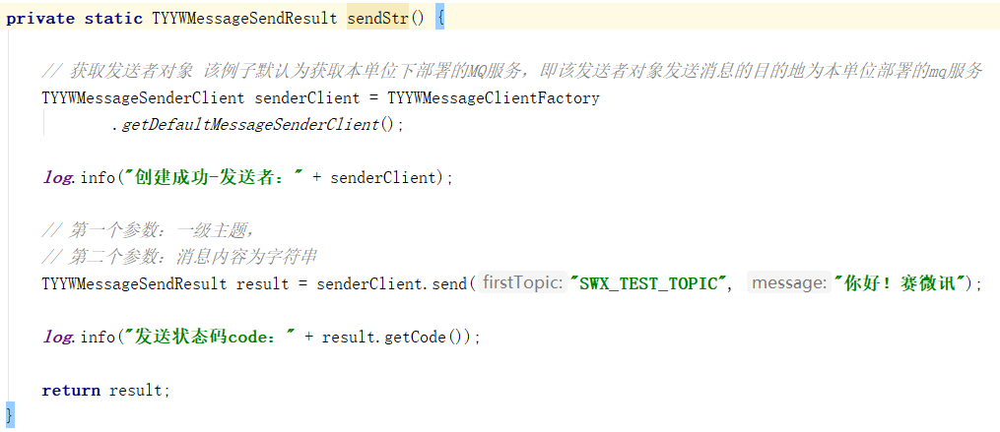
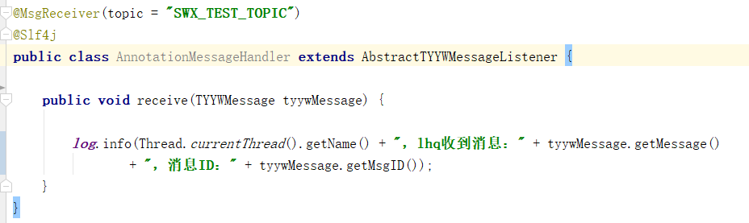
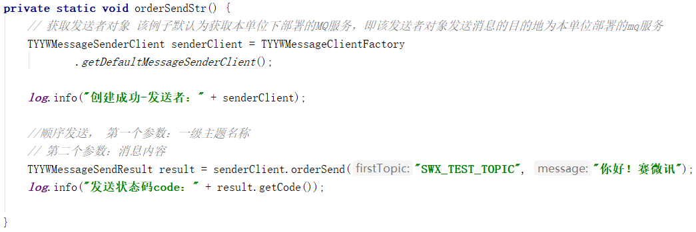
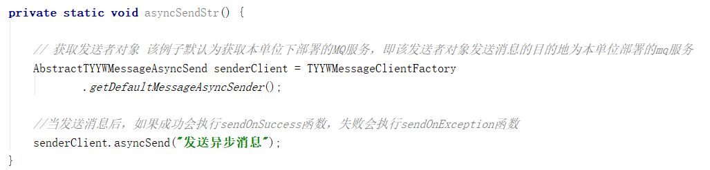
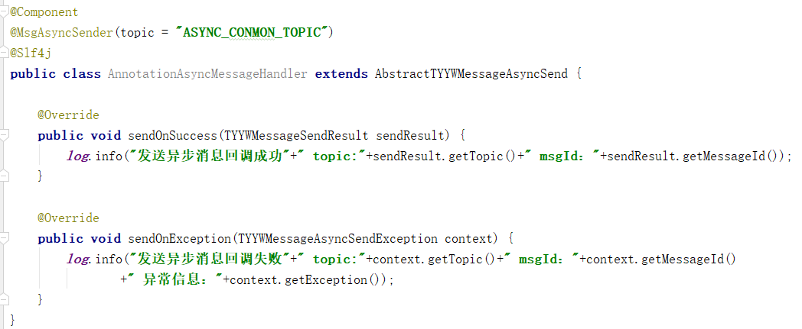
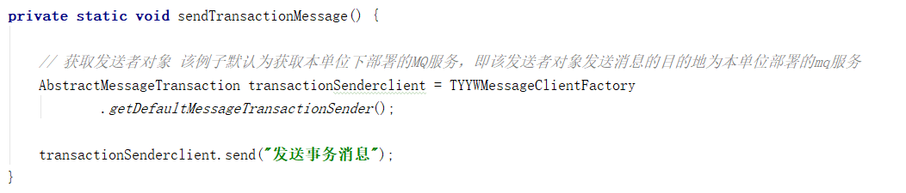
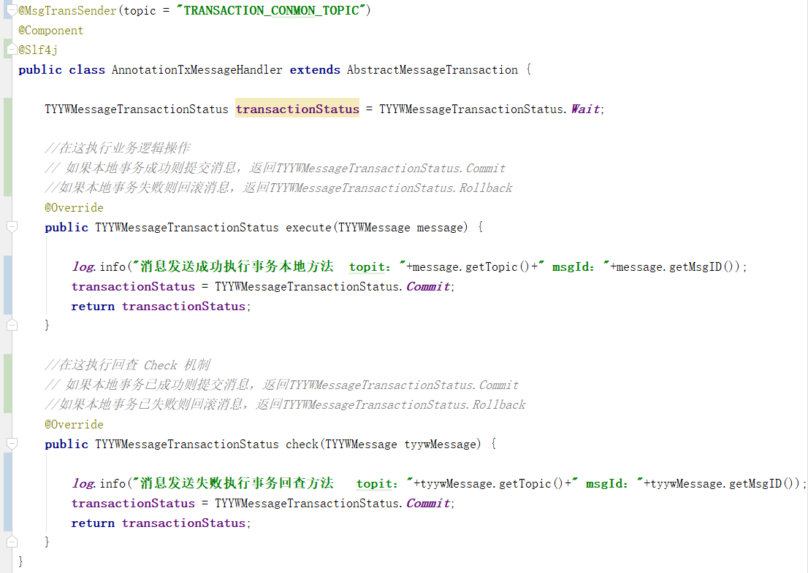

# 消息系统API使用说明

## 1概述
本文档用于说明消息系统API的使用方式及步骤，为开发人员提供开发指导及接口描述，并包括部分演示代码。
## 2使用说明
使用消息系统API的步骤主要分为三个步步骤，包括导入jar包、添加配置、调用API等。
### 项目导入API
#### 1.包名
messagesystem-api.jar
#### 2.导入jar包
implementation ("com.tyyw:messagesystem-api:0.0.1")
#### 3.在build.gradle中引入相关依赖
implementation 'com.aliyun.openservices:ons-client:1.8.0.Final'     
implementation 'commons-beanutils:commons-beanutils:1.9.2'
### 配置
在application.yml中添加相关配置     
################### 消息系统配置信息 ###############        
#msgsys代表以下配置是消息系统相关的配置     
msgsys:     
  #IP代表消息子系统运行的服务器及访问端口   
  IP: 192.168.2.6:8086  
  #使用消息的微服务的组ID，需要标识唯一性。     
  GROUP_ID: test_msg_demo
### API使用
#### 普通消息
- 普通消息发送   

1．通过TYYWMessageClientFactory工厂类获取发送者客户端对象TYYWMessageSenderClient    
2． 调用send方法发送消息，相关参数如下：    
第一个参数     firstTopic     一级主题  
第二个参数     message        消息内容

- 普通消息接收   

1.通过自定义注解类MsgReceiver设置需要接收消息的topic主题名称    
2.通过继承AbstractTYYWMessageListener类重写receive方法接收消息
#### 顺序消息
- 顺序消息发送   

1．通过TYYWMessageClientFactory工厂类获取发送者客户端对象TYYWMessageSenderClient    
2． 调用orderSend方法发送消息，相关参数如下：   
第一个参数     firstTopic     一级主题  
第二个参数     message        消息内容

- 顺序消息接收   

普通消息接收
#### 异步消息
- 异步消息发送   

1．通过TYYWMessageClientFactory工厂类获取异步发送者客户端对象AbstractTYYWMessageAsyncSend   
2.调用asyncSend方法传入消息内容（message）发送异步消息       

1. 通过自定义注解类MsgAsyncSender设置发送异步消息的topic主题名称
2. 通过继承AbstractTYYWMessageAsyncSend类重写sendOnSuccess和sendOnException方法，当发送消息后，如果成功会执行sendOnSuccess函数，失败会执行sendOnException函数

- 异步消息接收   
普通消息接收
#### 事务消息
- 事务消息发送   

1．通过TYYWMessageClientFactory工厂类获取事务发送者客户端对象AbstractMessageTransaction
2． 调用send方法传入消息内容（message）发送事务消息     

1. 通过自定义注解类MsgTransSender设置发送事务消息的topic主题名称    
2. 通过继承AbstractMessageTransaction类重写execute和check方法，当发送消息后，会执行execute方法，本地事务成功则提交消息返回TYYWMessageTransactionStatus.Commit，本地事务失败则回滚消息返回TYYWMessageTransactionStatus. Rollback。如果执行本地事务一直没提交状态，等待服务器回查消息的事务状态，调用check方法，如果本地事务已成功则提交消息，返回TYYWMessageTransactionStatus.Commit，如果本地事务已失败则回滚消息，返回TYYWMessageTransactionStatus.Rollback。

- 事务消息接收   
普通消息接收
