# 开发环境搭建

### [软件包下载请点击这里](https://192.168.2.187/!/#%E7%BB%9F%E4%B8%80%E4%B8%9A%E5%8A%A12.0/view/head/99_%E9%A1%B9%E7%9B%AE%E8%B5%84%E6%96%99/%E5%9F%BA%E7%A1%80%E7%8E%AF%E5%A2%83%E5%AE%89%E8%A3%85%E5%8C%85)   

## JDK
#### 安装JDK

<!-- 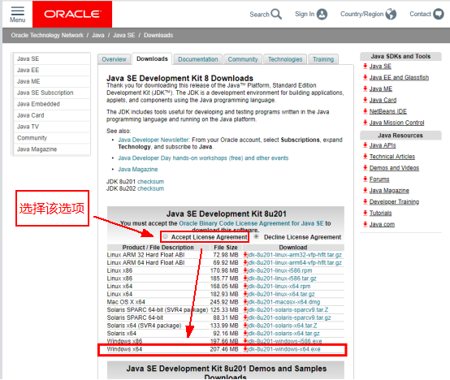 -->

下载之后就是安装了，一直下一步。记住你的安装路径，后面配置环境变量会用到。
#### 配置环境变量
右击我的电脑->属性->高级系统设置->高级->环境变量		
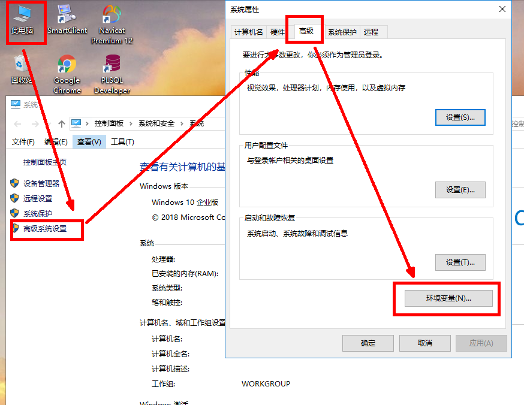

新建系统变量，变量名JAVA_HOME		
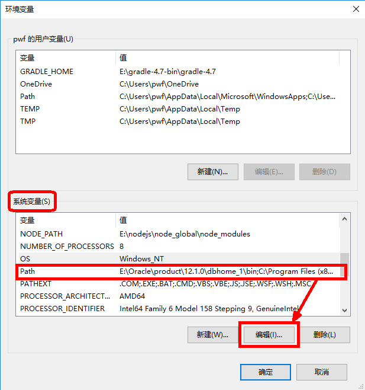

编辑系统变量中的变量名Path		
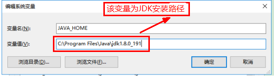		
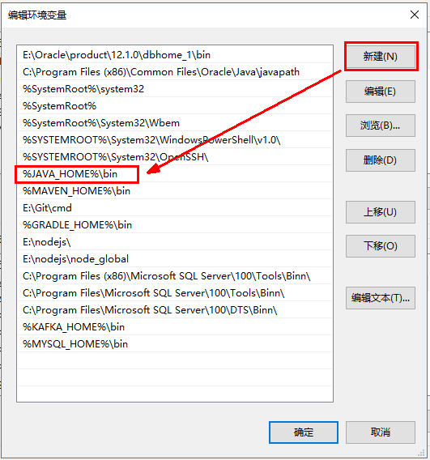
#### 测试是否配置成功
window+R 输入cmd,打开dos界面，输入java -version，如出现下图样，则配置成功。		
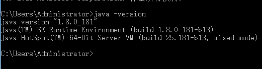

<!-- !>以下提供两种包管理器的配置，请根据自己的喜好做选择！

## Maven
#### 下载并安装maven
[maven下载链接](http://maven.apache.org/download.cgi)

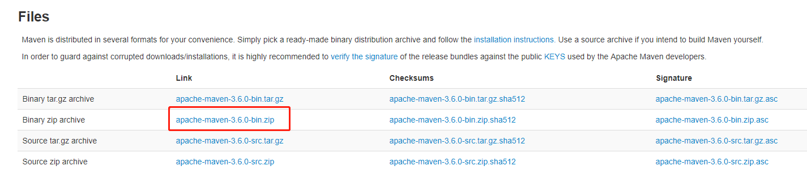

下载后直接解压，存放路径自己决定。
#### 配置maven环境
我的电脑->属性->高级系统设置->高级->环境变量        

新建系统变量：MAVEN_HOME，变量值为刚解压的maven路径，我的是D:\apache-maven-3.5.0。      
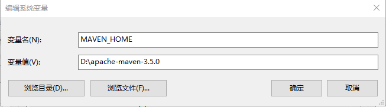

再在Path变量中加上:%MAVEN_HOME%\bin;        
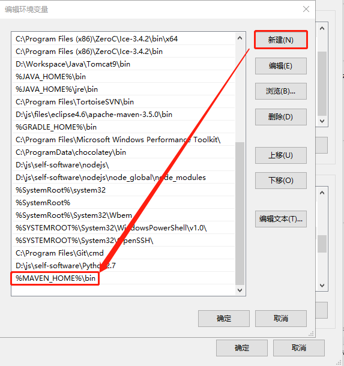

#### 测试是否配置成功
windows+r 输入cmd,打开dos命令界面，输入mvn -v 进行测试，如出现下图样，则配置成功。		
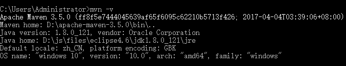 -->

## Gradle
#### Gradle下载

<!-- 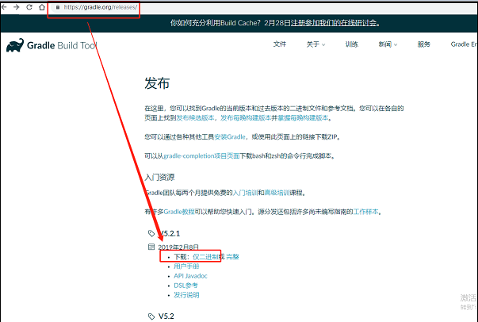 -->

####  安装
下载完成之后，解压后放入自己想要放入的指定文件夹

示例：E:\gradle-4.7
    
#### 配置环境变量

###### ① 从控制面板进入系统，点击高级系统设置

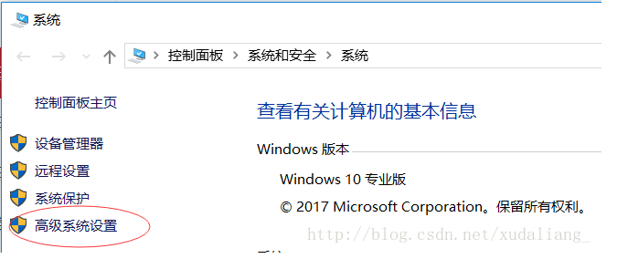

###### ②点击环境变量

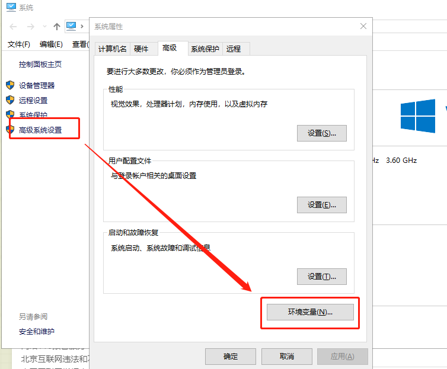

###### ③在系统变量中新建变量并加入路径，如下图所示，点击保存

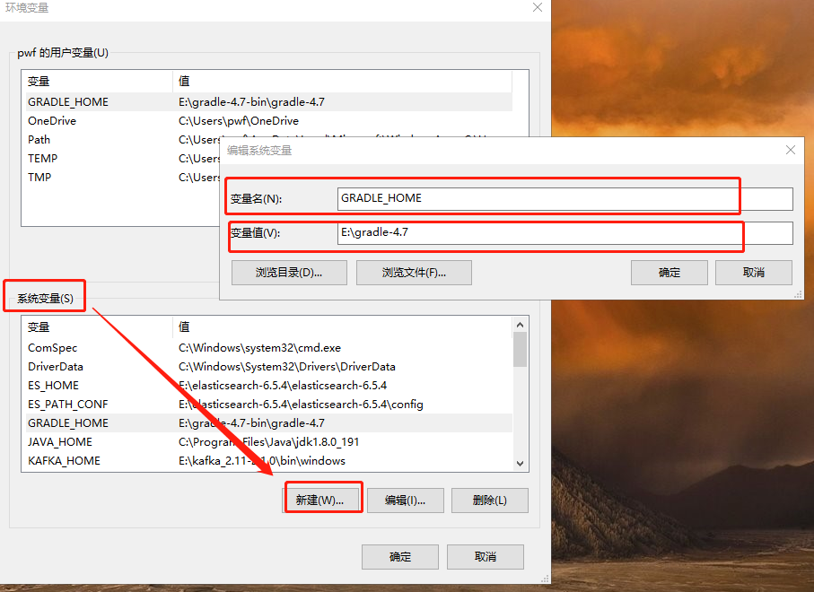

###### ④编辑Path，加入路径如下图所示，点击保存

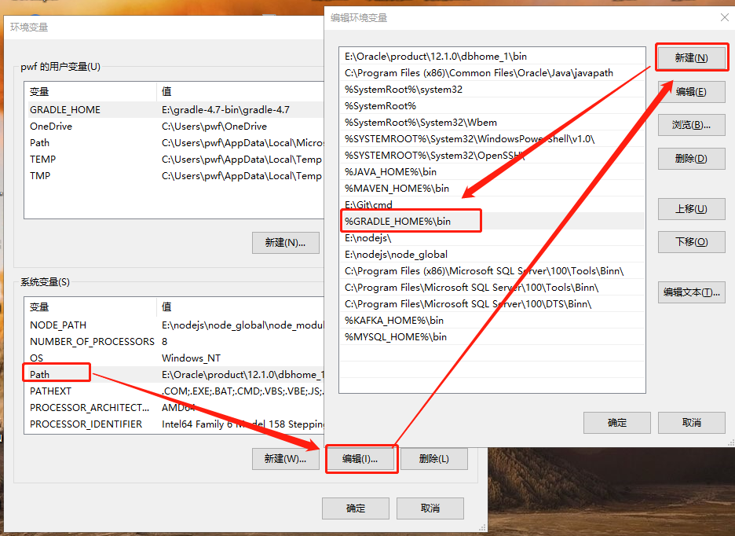

#### 验证是否配置成功

进入cmd后，输入gradle -v,显示如下，则配置成功 
    
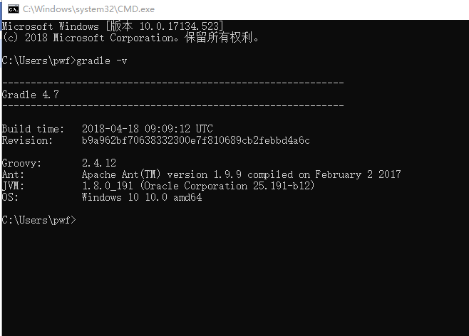