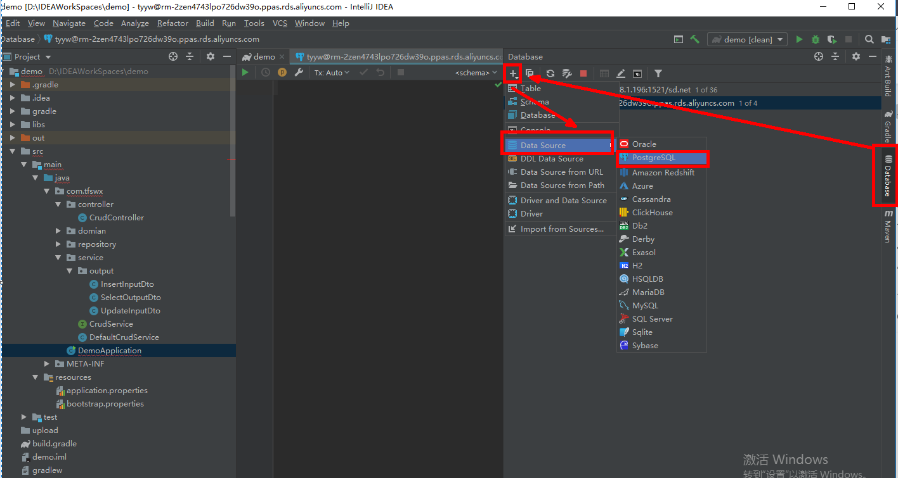
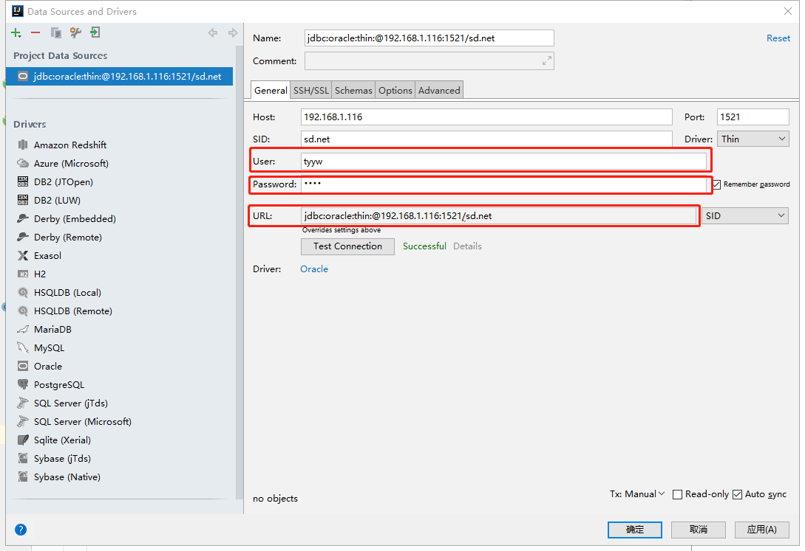
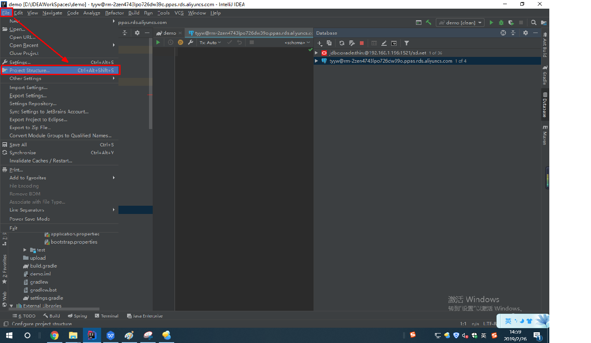
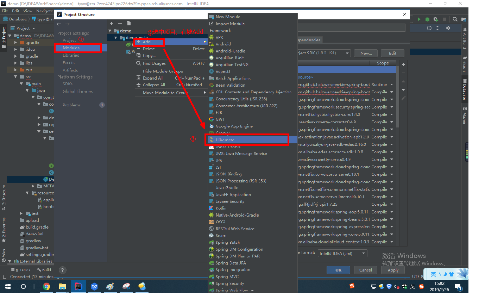
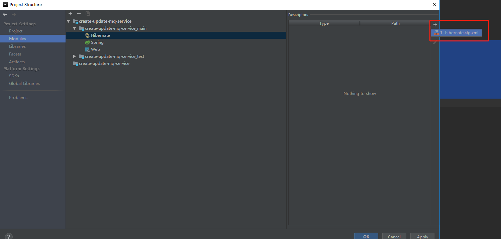
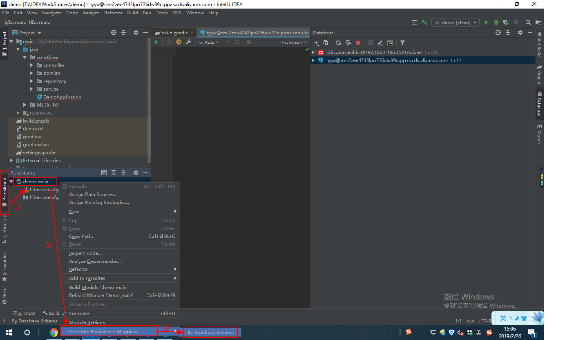
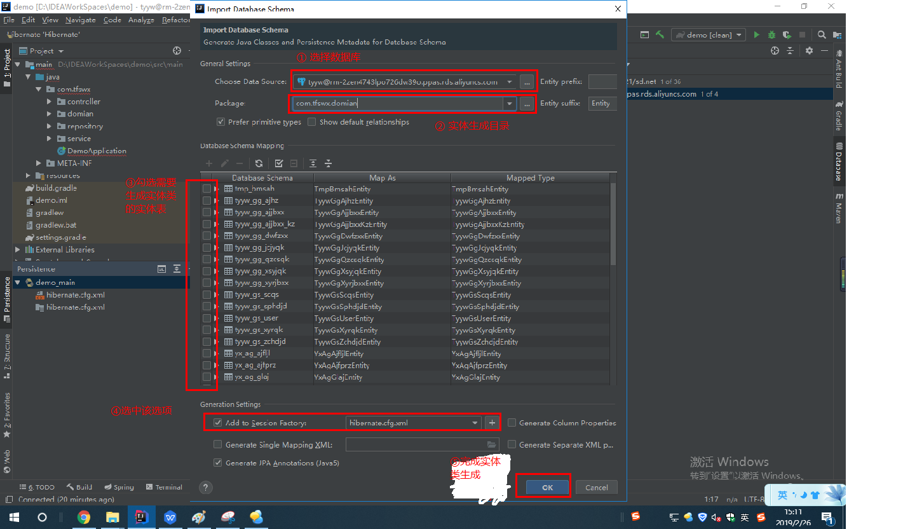

!> 此处只指示在IDEA中如何自动生成实体类

##### 1.在IDEA右侧点击Database，如图所示选择对应数据库

##### 2.在弹出框中配置数据源

填入User、Password、URL即可，然后点击Test Connection，如图所示显示Successful说明连接成功。再点击OK。

##### 3.添加hibernate.cfg.xml文件

①点击File--->Project Structure      

②选中Modules，右键点击main模块，选中add，在列表中选择Hibernate      

③点击下图中所示位置的＋按钮，添加hibernate.cfg.xml      

④点击OK

##### 4.如下图所示，进行以下操作：

①点击左侧的Persitence       
②右键点击项目main模块       
③选择Generate Persicente Mapping        
④点击By Database Schema         

##### 5.如下图所示，在弹出框中做以下配置：
①在General Settings的Choose Data Source中，选择我们在第1、2步骤中添加的数据源       
②在General Settings的Package中，选择待生成实体的存放目录        
③勾选要生成实体类的数据库表     
④勾选Generation Settings中的Add to Session Factory选项      
⑤点击OK     

##### 6.等待生成完成后，就可以在存放目录中看见生成的实体类了