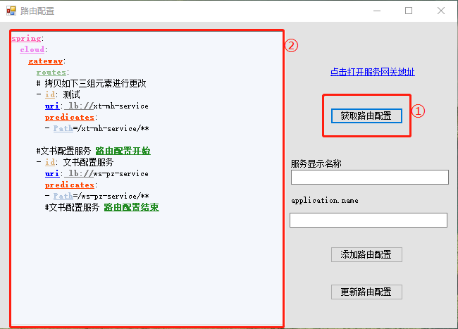
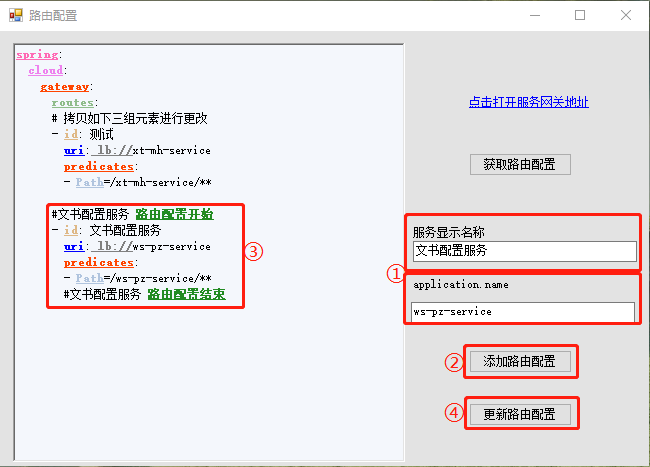
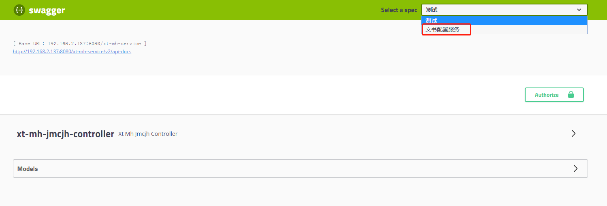
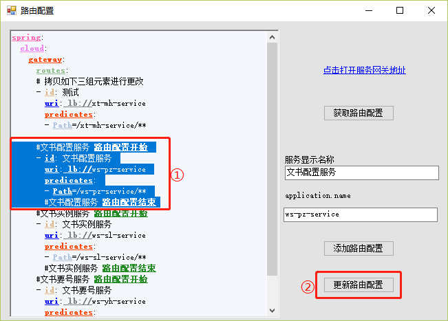

?> 默认已经获取到路由配置工具并打开它了。若要获取路由配置工具点击[这里](https://192.168.2.187/!/#%E7%BB%9F%E4%B8%80%E4%B8%9A%E5%8A%A12.0/view/head/99_%E9%A1%B9%E7%9B%AE%E8%B5%84%E6%96%99/%E5%9F%BA%E7%A1%80%E7%8E%AF%E5%A2%83%E5%AE%89%E8%A3%85%E5%8C%85)

### 获取路由配置
点击```获取路由配置```按钮（图中①处），就能在左侧显示窗中看见获取到了当前的路由配置（图中②处）。


### 添加路由配置
!> 执行如下操作时，在点击```添加路由配置```按钮之前，请先点击```获取路由配置```按钮。避免将其他人新增的配置覆盖！
##### 一、在```服务显示名称```、```application.name```处填入服务信息，参考如图中①处。

##### 二、点击```添加路由配置```按钮（图中②处），就能在左侧显示窗中看见新增的路由配置了（图中③处）。

##### 三、点击```更新路由配置```按钮（图中④处），然后可看见内容为`配置更新成功`的弹窗，最后点击```确定```。     


##### 四、点击链接`点击打开服务网关地址`，在图示位置就可以看见新增的服务名称了，可以点击列表中的服务名称进行切换服务。      


### 删除路由配置
?> 如果添加的路由配置信息有误，可将添加的路由配置信息删除。    
##### 一、在左侧的显示窗中，选中需要删除的路由配置（下图中①处）。
##### 二、按下键盘上的Backspace或Delete键，可将选中的路由配置删除。
##### 三、然后点击```更新路由配置```按钮（下图中②处），可看见内容为`配置更新成功`的弹窗，然后点击```确定```。     
