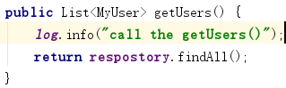
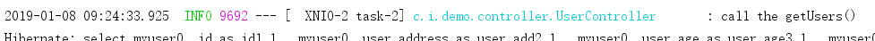

### 概述
本文档是基于ELK对SpringBoot项目的日志进行采集的教程，默认ELK已经搭建好了。ELK拥有：强大的搜索功能，elasticsearch可以以分布式搜索的方式快速检索，而且支持DSL的语法来进行搜索，简单的说，就是通过类似配置的语言，快速筛选数据；完美的展示功能，可以展示非常详细的图表信息，而且可以定制展示内容，将数据可视化发挥的淋漓尽致；分布式功能，能够解决大型集群运维工作很多问题，包括监控、预警、日志收集解析等。

### 项目配置
要实现使用Logstash采集SpringBoot项目中的日志，需要对项目进行一些配置。

1. 在pom.xml中添加依赖：
    ```
    <dependency>
        <groupId>net.logstash.logback</groupId>
        <artifactId>logstash-logback-encoder</artifactId>
        <version>5.2</version>
    </dependency>
    ```
2. 在resources目录下新建logback-spring.xml文件。在此文件中做如下配置：
    ```
    <?xml version="1.0" encoding="UTF-8"?>
    <configuration>
        <include resource="org/springframework/boot/logging/logback/base.xml" />
    
        <appender name="LOGSTASH" class="net.logstash.logback.appender.LogstashTcpSocketAppender">
            <destination>localhost:5000</destination>
            <encoder charset="UTF-8" class="net.logstash.logback.encoder.LogstashEncoder" />
        </appender>
    
        <root level="INFO">
            <appender-ref ref="LOGSTASH" />
            <appender-ref ref="CONSOLE" />
        </root>
    </configuration>
    ```
    > 为了让logstah接受到输入，请确保destination标签中的地址与logstash配置文件中的input的host和port一致。
	logstash.conf文件input的配置应为
	```
	input {
		tcp {
			host => "localhost"
			port => "5000"
		}
	}
	```
    
#### 日志采集
在项目做好配置之后，logstash就会自动采集项目中输出的日志了。

也可以在代码中一些重要的地方打印出日志，操作如下：

- 在类名上使用 @Slf4j 注解。  

    
    
- 在需要打印日志的地方调用log。   



- 调用方法，就可以在控制台看见打印信息。


- 在kibana的Web页面中，我们可以看见我们也采集到了该条日志。

