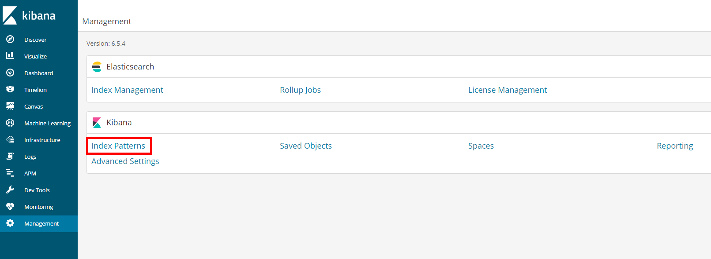
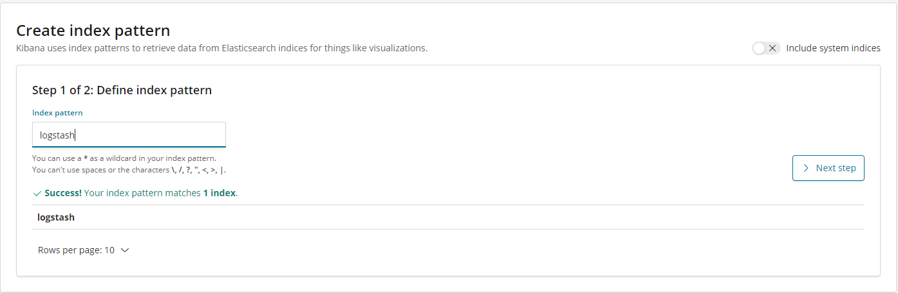
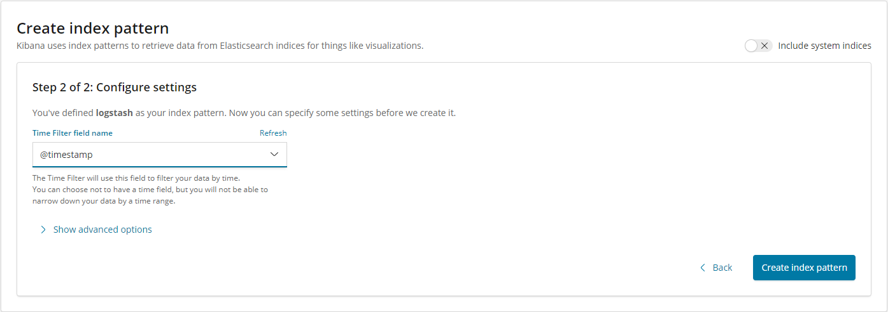
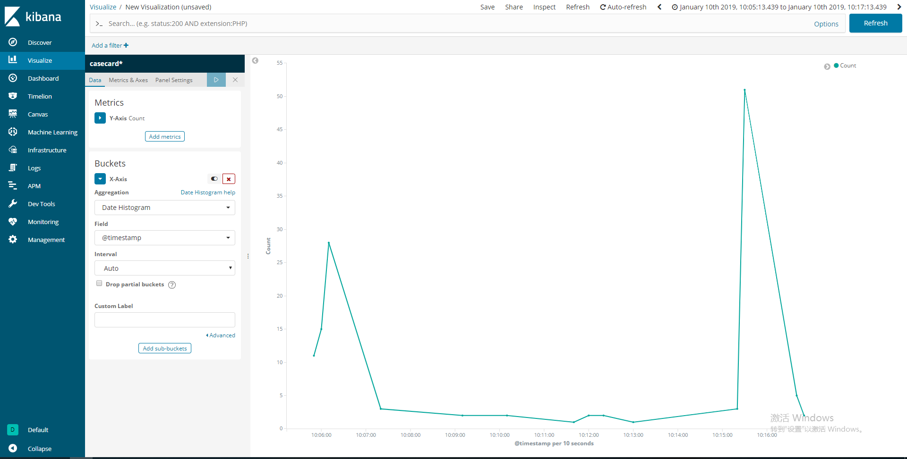
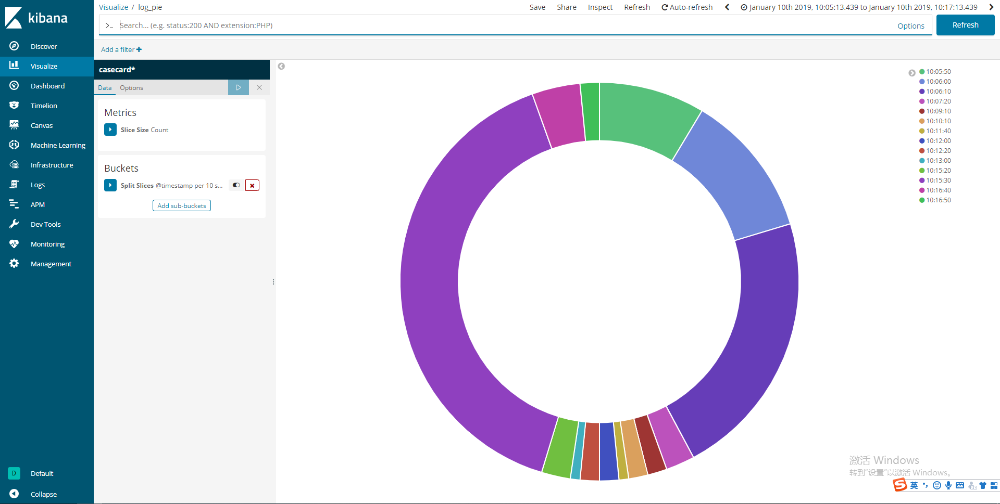
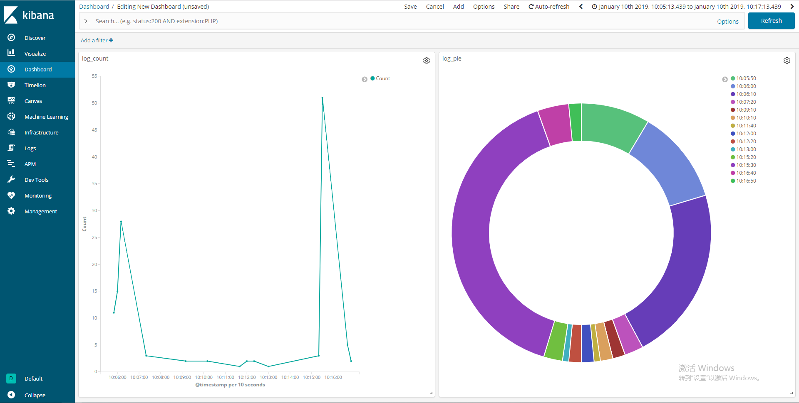

### ELK简介
ELK是elastic公司旗下三款产品Elasticsearch、Logstash、Kibana的简称。这三个工具组合形成了一套实用、易用的监控架构，很多公司利用它来搭建可视化的海量日志分析平台。用Elasticsearch作为后台数据的存储，kibana用来前端的报表展示。Logstash在其过程中担任搬运工的角色，它为数据存储，报表查询和日志解析创建了一个功能强大的管道链。    

### 组件介绍
- Elasticsearch 是一个基于Lucene的、支持全文索引的分布式存储和索引引擎，主要负责将日志索引存储起来，方便业务方检索查询。它的特点有：分布式、零配置、自动发现、索引自动分片、索引副本机制，restful风格接口，多数据源，自动搜索负载等。
- Logstash 主要是用来日志的搜集、分析、过滤、转发的工具，支持大量的数据获取方式。主要负责将各条业务线的各类日志统一收集、过滤后转发给Elasticsearch进行下一步处理。
- Kibana 是一个可视化工具，主要负责查询Elasticsearch的数据并以可视化的方式展示给业务方，比如各类饼图、直方图、区域图等。

### ELK部署
**1**.在elastic官网下载elasticsearch、logstash、kibana的ZIP文件，然后解压。

**2**.修改elasticsearch/config目录中的elasticsearch.yml文件。如下：

```
#设置绑定地址
network.host: "localhost"
#设置对外服务的http端口,默认为9200 
http.port: 9200
```
**3**.在logstash目录下的config文件夹中创建logstash.conf文件并做如下配置（具体日志文件路径需要自行修改）：
 ```
    input {
         file {
            path => ["D:/tomcat8/logs/localhost_access_log.*.txt"]
            start_position => "beginning"
         }
    }
	
	#过滤条件
	filter {
	}
    
    output {
       elasticsearch {
          hosts => ["localhost:9200"]
          index => "logstash"
       }
       stdout {}
    }
 ```
>  **注**：    
>  1. 日志文件路径要使用绝对路径，并且支持globs写法,如：
>      ```
>       file {
>         path => ["E:/software/logstash-1.5.4/logstash-1.5.4/data/*","F:/test.txt"]
>       }
>      ```
>  2. path中要使用“/”，已测试过使用“\”是不行的。     
>  3. 请将此配置文件的编码设置为UTF-8。
  
***说明：***   
 - 若读取不到日志文件的最后一条日志，请在最后一条日志的结束位置按回车换行。未能读取到最后一条日志是因为最后一行日志在没有下一行更新的日志到来之前，无法判断最后这一行日志是否已经结束。
 - 若读取到的日志存在乱码，请在file{ }中添加配置（请根据具体情况设置编码）：
    ```
    codec => plain {
            charset => "GBK"
        }
    ```

**4**.将kibana目录下的config文件夹中的kibana.yml文件做如下配置：

```
#设置kibana的服务端口
server.port: 5601
#设置kibana的服务地址
server.host: "localhost"
#Elasticsearch实例的URL
elasticsearch.url: "http://localhost:9200"
```
**5**.依次执行以下操作：
- 运行 elasticsearch 的 bin 目录中的 elasticsearch.bat 文件
- 在 logstash 的 bin 目录下，执行命令：logstash.bat -f ../config/logstash.conf
- 运行 kibana 的 bin 的目录中的 kibana.bat 文件

**6**.访问 http://localhost:5601 ,在Managenment中选择 Index Patterns	

create 名为logstash的 index pattern。     

点击 下一步，配置 Time Filter filed name(时间过滤器字段名称)，然后点击 create index pattern(创建索引模式)。

我们就可以在Discover中设置时间范围（图中红色框的位置），然后就看见此时间范围内采集到的日志了，并且可以通过搜索来筛选、查询日志。

我们还可以做一些图表组合成仪表盘，能更直观的显示不同时间段日志数目的统计情况。


