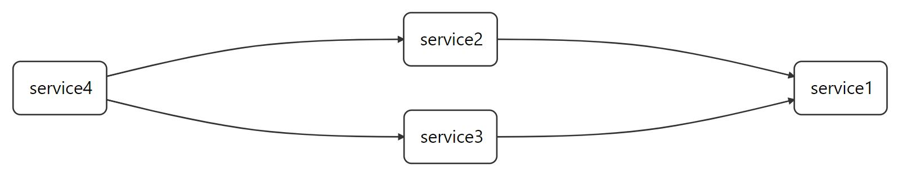

前期环境准备：默认已经启动好`eureka-server服务`http://192.168.1.161:8761/、`zipkin服务` http://192.168.1.161:9411

1.假设已准备好四个服务，分别为`service1`、`service2`、`service3`、`service4`

2.分别在`service2`、`service3`、`service4`模块分别添加zipkin依赖，服务注册示例见服务注册和发现目录。

```
   <dependency>
            <groupId>org.springframework.cloud</groupId>
            <artifactId>spring-cloud-starter-zipkin</artifactId>
    </dependency>
    <dependency>
            <groupId>org.springframework.cloud</groupId>
            <artifactId>spring-cloud-starter-feign</artifactId>
    </dependency>
        
```
3.在`service1` 模块添加`zipkin`依赖，由于四个模块都有zipkin依赖，可以放在父依赖中。

```
   <dependency>
            <groupId>org.springframework.cloud</groupId>
            <artifactId>spring-cloud-starter-zipkin</artifactId>
    </dependency>
          
```

4.在以上四个模块的原有的配置文件`application.yml`分别追加以下配置。

```
spring:
  sleuth:
    sampler:
      probability: 1.0
  zipkin:
    base-url: http://192.168.1.161:9411

```

5.编写`service1`模块。

- `controller`代码如下：

```
    @RestController
    public class ProviderController {
    
        @GetMapping("/{message}")
        public String getMessage(@PathVariable String message) {
            return message;
        }
    }
```
- 增加`application.yml`配置文件如下:

```
server:
  port: 8087

spring:
  application:
    name: service1

```

6.编写`service2`模块

- controller代码如下,并在启动类上添加注解`@EnableFeignClients`:

```
   @RestController
   public class ProviderController {

    @Autowired
    private ProviderService providerService;

    @GetMapping("/{message}")
    @HystrixCommand(fallbackMethod="getFallback")    
    public String get(@PathVariable String message){
        String message1 = providerService.getMessage(message);
        return "service2---->" + message1;
    }
    public String getFallback(@PathVariable String message) {   
        return "service2->回退机制" ;
    }

    }
```
- `service`代码如下：

```
    @FeignClient(value = "service1")
    public interface ProviderService {
        @GetMapping("/{message}")
        String getMessage(@PathVariable(value = "message") String message);
    }

```
- 增加`application.yml`配置文件如下：


```
server:
  port: 8083
spring:
  application:
    name: service2

```

7.编写`service3`模块
- `controller`代码如下,并在启动类上添加注解'@EnableFeignClients':

```
 @RestController
 public class ProviderController {

    @Autowired
    private ProviderService providerService;

    @GetMapping("/{message}")
    @HystrixCommand(fallbackMethod="getFallback")    
    public String get(@PathVariable String message){
        String message1 = providerService.getMessage(message);
        return "service3---->" + message1;
    }

    public String getFallback(@PathVariable String message) {   
        return "service3->回退机制" ;
    }

```
- `service`代码如下：

```
    @FeignClient(value = "service1")
    public interface ProviderService {
        @GetMapping("/{message}")
        String getMessage(@PathVariable(value = "message") String message);
    }

```
- 增加`application.yml`配置文件如下:

```
server:
  port: 8084
spring:
  application:
    name: service3

```
8.编写`service4`模块
- controller代码如下,并在启动类上添加注解'@EnableFeignClients':

```
 @RestController
 public class ConsumerController {

    @Autowired
    private ConsumerService consumerService;

    @Autowired
    private ConsumerService2 consumerService2;

    @GetMapping("/{message}")
    @HystrixCommand(fallbackMethod="getFallback")
    public String get(@PathVariable String message){
        String messageResult = consumerService.getMessage(message);

        return "service4---->" + messageResult;
    }

    public String getFallback(@RequestParam(value = "message") String message) {
        return message + " = 回退机制" ;
    }


    @GetMapping("/data/{message}")
    @HystrixCommand(fallbackMethod="getFallback2")
    public String getData(@PathVariable String message){
        String messageResult = consumerService2.getMessage(message);
        return "service4---->" + messageResult;
    }

    public String getFallback2(@RequestParam(value = "message") String message) {
        return message + " = 回退机制" ;
    }


```

- `service`代码如下：

```
    @FeignClient(value = "service2")
    public interface ConsumerService {
        @GetMapping("/{message}")
        String getMessage(@PathVariable(value = "message") String message);
    }

    @FeignClient(value = "service3")
    public interface ConsumerService2 {
        @GetMapping("/{message}")
        String getMessage(@PathVariable(value = "message") String message);
    
    }

```

- 增加`application.yml`配置文件如下:


```
server:
  port: 8088
spring:
  application:
    name: service4

```


9.然后分别启动四个模块即可，分别调用`http://localhost:8088/message=feign`，`localhost:8088/data/message=feign`,`zipkin`中展示调用链路图如下：


